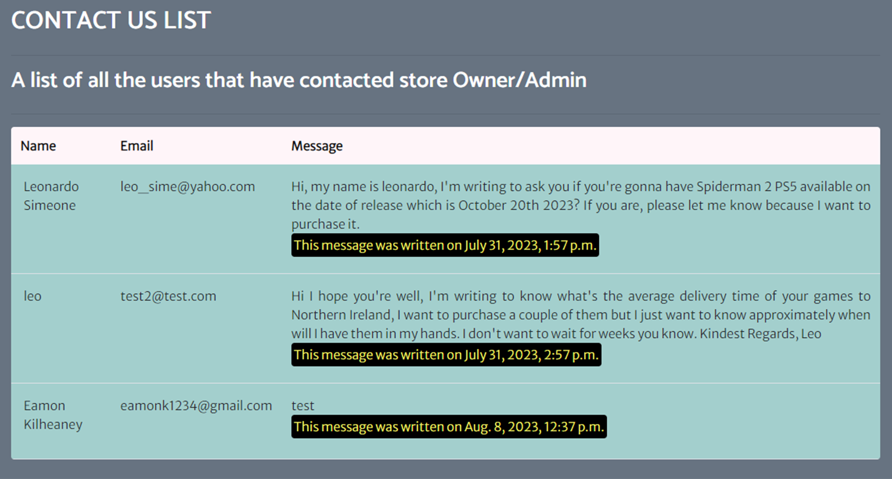
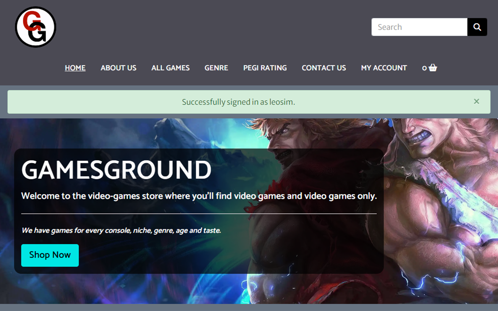
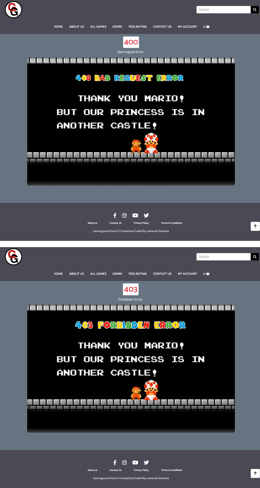
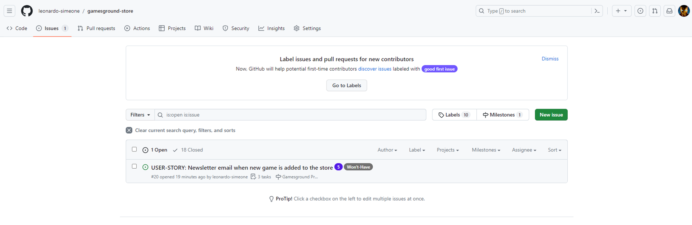
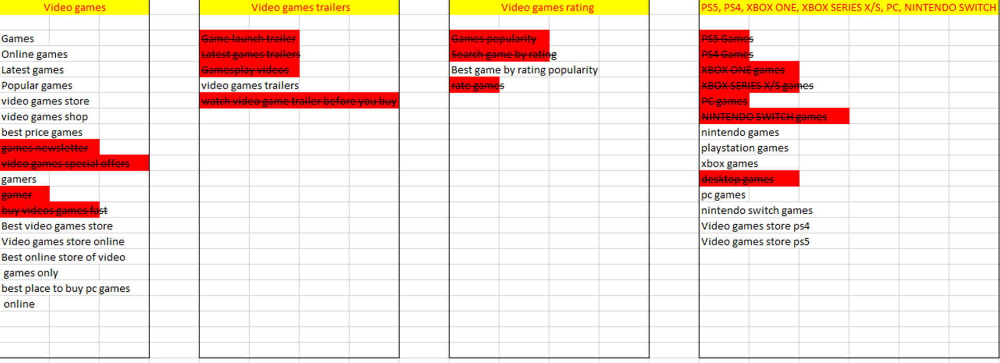
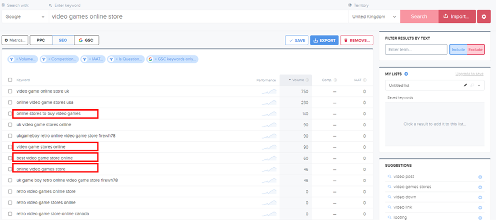
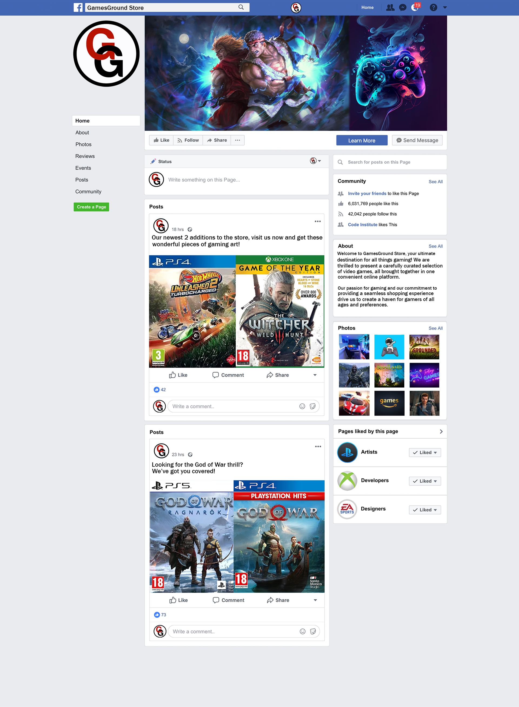

# Table of Contents

1. [Gamesground Store](#gamesground-store)
2. [UX](#ux)
    - [Colour Scheme](#colour-scheme)
    - [Typography](#typography)
3. [User Stories](#user-stories)
    - [Site Users](#site-users)
    - [Site Admin](#site-admin)
    - [Product Owner](#product-owner)
4. [Wireframes](#wireframes)
    - [Pages Wireframes](#pages-wireframes)
5. [Features](#features)
    - [Existing Features](#existing-features)
    - [Future Features](#future-features)
6. [Tools & Technologies Used](#tools--technologies-used)
7. [Database Design](#database-design)
8. [Agile Development Process](#agile-development-process)
    - [GitHub Projects](#github-projects)
    - [GitHub Issues](#github-issues)
    - [MoSCoW Prioritization](#moscow-prioritization)
9. [Ecommerce Business Model](#ecommerce-business-model)
10. [Search Engine Optimization (SEO) & Social Media Marketing](#search-engine-optimization-seo--social-media-marketing)
    - [Keywords](#keywords)
    - [Sitemap](#sitemap)
    - [Robots](#robots)
    - [Social Media Marketing](#social-media-marketing)
    - [Newsletter Marketing](#newsletter-marketing)
11. [Testing](#testing)
12. [Deployment](#deployment)
13. [Credits](#credits)
    - [Content](#content)
    - [Media](#media)
14. [Acknowledgements](#acknowledgements)

## Gamesground Store

GamesGround Store, is an ecommerce site designed to provide video games users of a place where they can find information about video games, purchase them and provide feedback about games should they want to. What makes GamesGround Store special is the fact that this store is all about games, nothing else. Nowadays it is common to find thousands of ecommerce stores that sell video games but most of them offer video games and a plethora of other products more, in GamesGround we focus on games.

We give our users a place where they can look for video games and find information about them such as cool synopsis, games trailer videos, PEGI ratings, and of course competitive price. Our user can create their own profiles and save their information securely in our database for future transactions or they can simply purchase their games as guest users.

Users can also subscribe to our newsletter to avail of special offers, news and much more. External links to potential interesting site for users are also included such as gaming accessories shops, gaming news and reviews blogs and blogs about tips and tricks for games.

Store owners/admins can administer the site from the user interface, they have the option to add, edit and delete games as well as have access to the recieved messages and their corresponding information in the contact us section.


## UX

### Colour Scheme

* To select the colors, I used the [ColorSpace](https://mycolor.space/) website which provides the option to input any color you want and then it will provide a selection of matching/compatible colors that relate well to that "base" color you selected in the first place.
* Once I had my base color selected which is [#000000](https://mycolor.space/?hex=%23000000&sub=1), I used ColorSpace and it gave me a wide variety of compatible colors to work with from which I chose several of them and referenced them accordingly in the css style sheet.   


### Typography

* Since the google fonts page feature for fonts pairing suggestions was discontinued, I used an alternative tool available to select the fonts for the site.
* I browsed [heyreliable](https://heyreliable.com/ultimate-google-font-pairings/) google fonts pairings available in their collection and selected number 35 based on the look and mood wanted for the site.
    


* These fonts are clear to read, they have a friendly yet professional style which is compatible with a video games store website.

- [Catamaran](https://fonts.google.com/specimen/Catamaran) was used for the primary headers and titles.

- [Merriweather Sans](https://fonts.google.com/specimen/Merriweather+Sans) was used for all other secondary text.

- [Font Awesome](https://fontawesome.com) icons were used throughout the site, such as the social media icons in the footer, contact link, newsletter link, among others.

## User Stories

### Site Users

- As a Site User I would like to register for an account so that I can login and out with personal account and recover my password in case I forget it, [Link here](https://github.com/leonardo-simeone/gamesground-store/issues/1).
- As a Site User I would like to view a list of games so that I can select one or more to purchase, [Link here](https://github.com/leonardo-simeone/gamesground-store/issues/6).
- As a Site User I would like to view an individual game so that I can identify its name, price, image, genre, description, year, platform, pegi rating, trailer video and likes count, [Link here](https://github.com/leonardo-simeone/gamesground-store/issues/7).
- As a Site User I would like to search for a specific game name or genre so that I can easily find the game I want to purchase, [Link here](https://github.com/leonardo-simeone/gamesground-store/issues/8).
- As a Site User I would like to sort games by price, genre, name, pegi rating and popularity so that I can easily find the games according to my preferences, [Link here](https://github.com/leonardo-simeone/gamesground-store/issues/9).
- As a Site User I would like to add, view, update and delete games in the shopping basket so that I can manage/review my shopping basket before proceeding to checkout, [Link here](https://github.com/leonardo-simeone/gamesground-store/issues/10).
- As a Site User I would like to easily view the total amount of games in my shopping basket so that I can know how many games are there in my basket at all times, [Link here](https://github.com/leonardo-simeone/gamesground-store/issues/11).
- As a Site User I would like to provide the necessary billing/delivery details so that I can purchase games and view an order confirmation after checkout to verify all the information from my purchase is accurate, [Link here](https://github.com/leonardo-simeone/gamesground-store/issues/12).
- As a Site User I would like to receive an email confirmation after my purchase so that I can keep records of my transactions, [Link here](https://github.com/leonardo-simeone/gamesground-store/issues/13).
- As a Site User I would like to create/manage my personal account profile so that I can view/update my profile, view my order history and save my payment information, [Link here](https://github.com/leonardo-simeone/gamesground-store/issues/14).
- As a Site User I would like to contact the site administrator so that I can query/recommend the site admin on different topics, [Link here](https://github.com/leonardo-simeone/gamesground-store/issues/16).
- As a Site User I would like to subscribe to a newsletter so that I can receive news, special offers and general information related to the store, [Link here](https://github.com/leonardo-simeone/gamesground-store/issues/17).
- As a Site User I would like to navigate to the site's about us, terms & conditions and privacy policy links so that I can inform myself in more depth about the site, [Link here](https://github.com/leonardo-simeone/gamesground-store/issues/19).
- As a Site User I would like to receive an email every time a new game is added to the store so that I will be up to date with what games are available, [Link here](https://github.com/leonardo-simeone/gamesground-store/issues/20).

### Site Admin

- As a site administrator, I should be able to create/add, read, update and delete games so that I can manage the games on the site, [Link here](https://github.com/leonardo-simeone/gamesground-store/issues/2).
- As a site administrator, I should be able to add, update and delete pegi ratings so that I can assign pegi ratings to games, [Link here](https://github.com/leonardo-simeone/gamesground-store/issues/4).
- As a site administrator, I should be able to add, update and delete platforms so that I can assign platforms to games, [Link here](https://github.com/leonardo-simeone/gamesground-store/issues/5).
- As a site administrator/site owner, I should be able to add/edit/delete games from the website so that I can manage new games, games updates or games that are no longer available, [Link here](https://github.com/leonardo-simeone/gamesground-store/issues/15).

### Product Owner

- As a product owner, I should be able to run automated tests, so that I can make sure everything is working as it should, [Link here](https://github.com/leonardo-simeone/gamesground-store/issues/18)

## Wireframes

To wireframe the website I used [Whimsical](https://whimsical.com/wireframes).

### Pages Wireframes

| Page | Screenshot |
| --- | --- |
| All pages |  |
| Home |  |
| Games |  |
| Game detail |  |
| Login/Register |  |
| About us |  |
| Add game |  |
| Edit game |  |
| Basket |  |
| Checkout |  |
| Checkout success |  |
| Contact/Newsletter |  |

## Features

### Existing Features

- **Navagation Bar**

    - The navigation bar is located at the top of the screen and it's centered both vertically and horizontally. It has the site logo on the left side and the search bar on the right side, below these two elements we find the navigation links for Home, About Us, all games (dropdown menu), genre (dropdown menu), pegi rating (dropdown menu), contact us and my account (dropdown menu).
    - The navigation bar is fully responsive thanks to the use of Bootstrap, also the layout changes to expandable and fully vertical once small screens are used.
	- When small screens are used the search icon is clickable and once clicked on, it drops down a search bar.
    - All links in the navigation menu have visual cues (except for platform, genre and pegi, given these are gotten via filtering) regarding where the user currently is on the site, as well as which links are they about to click on, making it easier to navigate.
    - The navigation menu is identical across all the pages on the site which provides quick navigation learning.


- **Home/Index**

    - The home page welcomes the user (new or returning) to the site, it subtly and intuitively shows the user what the site is about via a jumbotron with image/text and what it offers, which is a site about video games where users can easily find video games for different consoles, genres and ages, giving them as well a call to action button to start shopping. Below the jumbotron the home page lets the user quickly go to three different consoles games array should they choose to and on the third section, three links are porvided to lead the user to the games page, the newsletter and the contact us page.


- **Register**

    - The register page allows the user as its name indicates to register to the site. The user needs to supply a first name, last name, username, email and confirm email, password and confirm password, once the sign up button is clicked on, the user will be shown a message indicating a confirmation email has been sent to the email provided and that they need to confirm their email in order to complete the registration process.
	- The register page also provides a link for the user to go to the login page in case they're already registered as well as a back to login button.
    - This functionality is achieved thanks to the power of Django allauth.


- **Register confirmation email**

    - Once the user is registered a confirmation email is sent to the email address provided, when the user clicks on the link provided in the confirmation email, the user is taken back to the site with a confirm email message, once the user clicks confirm, a success message is displayed and the user is taken to the login page.


- **Login**

    - The login page allows a registered user to login with their username and password.
	- The form contains a checkbox which is unchecked by default, this option will allow the user to remember their session or not.
    - Once logged in, the user can avail of the features that an authenticated user is allowed, such as create their own profile, view their order history and like games.
    - Should the user not be registered yet, the option to do so is provided at the top of the form with a link.
	- At the the bottom of the form the user has 2 buttons, one to login and another to go home.
	- If the user forgot their password they have the option to reset it via a link provided at the end of the form.
    - As all the forms in the site, the login form was design to provide optimal UX. 


- **Logout**

    - The logout page allows a logged in user to logout.
    - A confirmation question will asked to the user before logging out.
    - There are two buttons at the bottom, one to confirm the logout action and one to cancel which will bring the user back home.


- **About Us**

    - The about us page is an informational page where the user can find more detailed information regarding the website and its purpose.
    - There are three informative paragraphs, one for about us, one for our mission and one for what we offer.
    - At the end of the page there is a final section with external links for other potential interests the user might have such as games guides, reviews blogs and games accessories shops.


- **Games**

    - The games page is where the games the store is selling are displayed, they're displayed in cards that contain the game's image, name, price, platform and likes count.
	- Thanks to bootstrap for large screens the cards are laid out in rows of four columns, for medium screens in rows of three columns and for small in rows of one column.
	- At the top of the screen a free delivery banner is shown to the user to let them know that delivery is free once they spend €30 or more.
	- After the free delivery offer banner, we find the heading and a series of badges indicating the available games groups by platform, should the user click on one of them, they will be brought to the games page filtered by the specific platform games group.
	- Next on the left side, there is a 'Games Home' link which will bring the user back to 'all games' meaning all games will be displayed without sorting or filtering and next to the 'Games Home' link, the amount of games rendered at any given time will be displayed.
	- On the right side there is a 'Sort by' drop down menu that allows the user to sort the games they're looking at by price (low-high, high-low), popularity (low-high, high-low), pegi rating (low-high, high-low), name (A-Z, Z-A) and Platform (A-Z, Z-A), thanks to a combination of python code in the view and Django template logic.


- **Games by genre**

    - The games page is basically the same, except for the fact that the badge will be the selected genre and the games displayed will contain the selected genre.


- **Games by pegi rating**

    - The games page is basically the same, except for the fact that the badge will be the selected pegi rating and the games displayed will contain the selected pegi rating.


- **Games as admin**

    - The games page is basically the same, except for the fact that when a user with superuser privileges is logged in, the option to edit and delete the games will be shown.


- **Game detail**

    - The game detail page shows the user all the game's attributes.
	- At the top of the screen the free delivery banner is displayed again the same as in the games page.
	- Next we find on the left of the screen the game's image and on the right side the name, price, quantity which can be adjusted by the user thanks to JS, a button to keep shopping which will bring the user back to 'all games' and a button to 'add to basket' which will indeed add the game to the basket.
	- Platform which is clickable and will bring the user to that particular platform games group.
	- Pegi rating which has the same fuctionality as platform (clickable).
	- Genre again with the same functionality as the previous two.
	- Next we have year and likes count, in years the game release year is shown and in the likes count, the user is shown how many likes the game has and if they're not logged in, that they need to login(link to login page) in order be able to like it, once they like the game by clicking on the heart icon, there will be an indicator letting them know they like the game.
	- Last on this section the user will be informed whether this game is available in other platforms or if it is exclusive.
	- On the next section below, the description of the game will be displayed as 'additional game information' and on the section after, there will be a game trailer video specific to the game being viewed.


- **Game detail as admin**

    - The game detail page is basically the same, except for the fact that when a user with superuser privileges is logged in, the option to edit and delete the game will be shown.


- **Shooping basket**

    - The shopping basket page is where the user will put all the games they want to purchase before proceeding with the checkout process.
	- Once a game is added to the basket the basket icon in the navbar will change in color, slightly in size and will show the amount of games in it at any given page the user decides to go.
	- In the basket page we see two headings, one to indicate it is the 'shopping basket' and the other one 'product info'.
	- The product info section is where all the info for the game or games added to the basket will be, this section was built as a table for large and medium screens and with bootstrap rows and columns for small screens.
	- The product info section shows the game's image, its name, price, quantity which can be adjusted by the user thanks to JS and the subtotal for that particular game (based on quantity).
	- Below the quantity amount there are two buttons one to update the quantity should the user decides to change it and one to remove the game altogether from the basket.
	- Next the user can see the 'basket total', the 'delivery' cost should there be any and the 'grand total' which is what the user will ultimately pay. Below the 'grand total' there will be a message for the user is the 'basket total' is below the free delivery threshold, this message will let the user know exactly how much more they will need to spend to avail of the free delivery offer.
	- Lastly there two buttons, one to 'keep shopping' which will bring the user back to 'all games' and one for 'secure checkout' which will take the user to the checkout page to start the checkout process.


- **Shooping basket empty**

    - Should the shopping basket be empty, a paragraph letting the user know will be displayed and there will be a button to 'keep shopping' which will take the user to 'all games' page.


- **Checkout**

    - The checkout page is where the user will input their delivery/payment details to complete the order.
	- Checkout is comprised by two sections, one is a form where the user will input their details such as full name, email address, phone number, street address, town, county, postal code, country, and card details, Should the user be registred and logged in, full name and email address will be prefilled and if they saved/updated their profile information the rest of the fields will also be prefilled (except for the card details). At the end of the form there will be two buttons and a message for the user. One button is to 'adjust basket' which brings the user back to the shopping basket and the other is to complete the order and the message is to indicate the user excatly how much their card will be charged.
	- The 'save info' checkbox in the form right after 'country' field, is for the user to save their info in their profile for future transactions and it is checked by default, in the case the user is annonymous then a message will show instead letting the user know that in order to save their info they need to register/login.
	- The second section will contain the order summary indicating the amount of games in the order, the game or games name, platform, quantity and subtotal and lastly the 'order total', 'delivery' cost and 'grand total'.


- **Loading spinner**

    - Once the user clicks on complete order, while the backend code and the stripe API do their job to process the payment, the user will see a friendly loading spinner indicating the payment is being processed.


- **Checkout success**

    - The checkout success page is where the user will be able to see the confirmation and summary of their just completed order.
	- In the checkout success page there is a heading thanking the user for their purchase, then a paragraph letting the user know that an order confirmation email will be sent to the email provided.
	- Below, the user can see a pseudo table with the 'order info' which contains 'order number' and 'order date', 'order details' containing game or games name, platform, quantity and price, then all the delivery information and lastly the billing info containing 'order total', 'delivery' and 'grand total'.
	- At the bottom there is a button 'check out all our games' which takes the user to the 'all games' page.


- **Oder confirmation email**

    - Once the order is successfully processed and completed a confirmation email will be sent to the user with the order details.


- **Profile**

    - The profile page shows the user their saved profile/delivery information and their order history.
	- At the top there is a heading indicating the user this is the 'my profile' page.
	- Below, the profile page is comprised of two sections, one with a form prefilled if the user decided to save their info in a previous purchase or if they updated their info in the profile page or empty otherwise, at the end of the form a button 'update information' which saves the information in the user profile.
	- The other section is the order history which is table containing the order or orders number, date, game or games name and quantity and the order total.
	- The order number is hoverable (shows the complete order number) and clickable, it takes the user to the order history view for that particular order number.


- **Order history**

    - The Order history page shows the user the information of a previous completed order.
	- Once the user clicks on the order number in their order history section in the profile page, the user is takes to the order history for that order.
	- The information shown in the order history is excatly to the information shown in the checkout success page given the same template is used, the difference thanks to some python code in the view and a little of Django template logic, is that for the order history, the user is shown an info message at the top indicating that 'This is a past confirmation for order number (order number). A confirmation email was sent on the order date.'
	- At the end of the page there is a button to go back to profile.


- **Add game**

    - The add game page allows authenticated users with superuser privileges to add a new game to the store.
	- There are two headings, one indicating you're in games management and a second one indicating that this is to add a game.
	- This page comprises a form with all the relevant fields to add a new game, such as name, genre, description, year, platform, price, pegi rating, image (a button to open a directory to select the image from), available in other consoles and trailer.
	- At the end of the form there are to buttons, one to cancel the action which will bring the user to 'all games page' and another to add game.
	- Once the game is added the user will be taken to the game detail view for the newly added game with a success message at the top.


- **Edit game**

    - The edit game page allows authenticated users with superuser privileges to edit an existing game in the store.
	- There are two headings, one indicating you're in games management and a second one indicating that this is to edit a game, also at the top of the page below the nav bar the user will see an info message indicating that they are editing the game.
	- This page comprises a form exactly the same as the add game form, the diference is that all the fields will be prefilled and the image (if any) will be shown as well as a checkbox to remove the image if the user chooses to.
	- At the end of the form there are to buttons, one to cancel the action which will bring the user to 'all games page' and another to update game.
	- Once the game is updated the user will be taken to the game detail view for the newly updated game with a success message at the top.


- **Delete game**

    - The delete game page allows authenticated users with superuser privileges to delete an existing game in the store.
	- There are two headings, one indicating you're in games management and a second one asking the user to confirm they are sure they want to delete the game.
	- There are to buttons at the bottom, one to cancel the action which will bring the user to 'all games page' and another to delete game.
	- Once the game is deleted the user will be taken to the 'games' page.


- **Forms errors**

    - As with every form across the entire site, should there be an error or missing information on a form, the user will be informed.


- **Contact us**

    - The contact us page allows the user should they have any question, concern or suggestion, to contact the site's admin.
	- There are two headings, one indicating the user they need to fill out the form to contact the site's admin and a second one letting the user know the admin will get back to them as soon as possible.
	- This page comprises a form where the user needs to input their name, email address and message, should the user be logged in, the name and email fields will be prefilled.
	- There are to buttons at the bottom, one to cancel the action which will bring the user to 'all games page' and another to send the message.


- **Amount of contact messages**

    - The user with superuser privileges will be able to see in the 'my account' dropdown menu a 'contact list' link with the amount of messages from users that have contacted the site's admin.


- **Contact us list**

    - The contact list page allows authenticated users with superuser privileges to view a list of the users and their messages that have contacted the site's admin.
	- There are two headings, one indicating the user this is the contact us list page and a second one letting the user know that this is a list of the users that have contacted the site's admin.
	- The page has a table for large and medium screens and a bootstrap rows and columns structure for small screens that contain the name, email address, message and date when the message was written for the user or users that have contacted the site's admin.



- **Newsletter**

    - The newsletter page allows the user to subscribe to the site's newsletter.
	- There are two headings, one indicating the user this is the newsletter page and a second one asking the user to subscribe to the newsletter to get the latest news, special offers and more on all the site's games.
	- This page comprises a form where the user needs to input their name and email address, should the user be logged in, the name and email fields will be prefilled.
	- There are to buttons at the bottom, one to cancel the action which will bring the user to 'all games page' and another to subscribe.


- **Messages**

    - Every time the user completes an action whether it be register, login, logout, like a game, create a game, update a game, delete a game, add a game to the shopping basket and all the rest, a relevant message will be displayed at the top of the screen to inform the user about the action being completed successfully.
    - Also should the user perform an unauthorized action such as trying to force their way to a page that requires permission, a message will also show.



- **404/500 Custom Pages**

    - The 404 and 500 custom error pages show said errors in a user friendly way.
    - The custom pages allow the user to avail of the navbar and footer present in all the other pages, making it easier for the user to go anywhere they want in the site after getting the error.


- **400/403 Custom Pages**

    - The 400 and 403 custom error pages show said errors in a user friendly way.
    - The custom pages allow the user to avail of the navbar and footer present in all the other pages, making it easier for the user to go anywhere they want in the site after getting the error.



- **Modals**

    - Privacy Policy and Terms & Conditions were included in modals.
    - A Bootstrap 4 scrolling long content modal was used for Terms & Conditions and Privacy Policy given the large content.
	- The [Privacy Policy Generator](https://www.termsfeed.com/privacy-policy-generator/) was used to created the privacy policy.


- **Back to Top Button**

    - A back to top button was included across the site to improve UX. The user will be able to go back to the top of the page with the click of a button instead of manually doing so.
    - The back to top button will show up only when the user starts to scroll down, when the user is located at the very top of the page the button will not be visible.


- **Footer**

    - The footer the same as the navbar, is identical across the site.
    - The footer contains several links. Links to social media such as Facebook, Instagram, YouTube and Twitter which open in a different tab. It also contains links to Privacy Policy and Terms & Conditions, which are both modals. Also links to the about us and contact us pages.
    - At the end of the footer there is the name of the site and the programmer's credits.


### Future Features

- Comment on games
    - Offer the user the option to comment on games.
- Edit/Update and delete own comments.
    - Offer the user the option to edit/update and delete their own comments.
- Create a blog app.
    - Create a blog app where the site's admin/owner can create content and the user can read on games news, reviews, tips and more.
- Add webhooks to checkout process.
    - Implement the use of webhooks during the checkout process.
- Add view logic in add_game view to send emails to Newsletter subscribers every time a new game is added to the store.
    - I effectively managed to add the logic to the add_game view to accomplish the task, I manually tested the functionality and it worked as intended, however in the unit testing side of things, I was having difficulty to test the Django send_mail() function call. Due to time limitations I decided to leave it as it is now and I will re engage the task in the future. Here is the code snippet I created in the add_game view to achieve the desired outcome:

    ```python
    # Newsletter subscribers email subject
    subject = 'New Game Added to the Store!'
    if request.method == 'POST':
            form = GameForm(request.POST, request.FILES)
            if form.is_valid():
                game = form.save()

                game_detail_url = request.build_absolute_uri(
                    reverse('game_detail', args=[game.id])
                    )

                # Send email to newsletter subscribers
                subscribers = Newsletter.objects.all()
                for subscriber in subscribers:
                    message = (
                        f'Hi {subscriber.name}, a new game "{game.name}" '
                        f'has been added to the store. '
                        f'Check it out: '
                        f'{game_detail_url}'
                    )
                    from_email = settings.DEFAULT_FROM_EMAIL
                    recipient_list = [subscriber.email]

                    send_mail(
                        subject,
                        message,
                        from_email, recipient_list
                    )

                messages.success(request, 'Successfully added game!')
                return redirect(reverse('game_detail', args=[game.id]))

    ```

## Tools & Technologies Used

- [HTML](https://en.wikipedia.org/wiki/HTML) used for the main site content.
- [CSS](https://en.wikipedia.org/wiki/CSS) used for the main site design and layout.
- [CSS Flexbox](https://www.w3schools.com/css/css3_flexbox.asp) used for an enhanced responsive layout.
- [CSS Grid](https://www.w3schools.com/css/css_grid.asp) used for an enhanced responsive layout.
- [JavaScript](https://www.javascript.com) used for user interaction on the site.
- [Python](https://www.python.org) used as the back-end programming language.
- [Git](https://git-scm.com) used for version control. (`git add`, `git commit`, `git push`)
- [GitHub](https://github.com) used for secure online code storage.
- [Gitpod](https://gitpod.io) used as a cloud-based IDE for development.
- [Bootstrap](https://getbootstrap.com) used as the front-end CSS framework for modern responsiveness and pre-built components.
- [Django](https://www.djangoproject.com) used as the Python framework for the site.
- [Django Allauth](https://django-allauth.readthedocs.io/en/latest/) used to auto handle user authentication process.
- [PostgreSQL](https://www.postgresql.org) used as the relational database management.
- [ElephantSQL](https://www.elephantsql.com) used as the Postgres database.
- [Heroku](https://www.heroku.com) used for hosting the deployed back-end site.
- [Gunicorn](https://gunicorn.org/) used as a server provider for the site.
- [Psycopg2](https://pypi.org/project/psycopg2/) used as a postgres database adapter.
- [Adobe Photoshop](https://www.adobe.com/ie/products/photoshop.html) used to resize/edit images as well as framing several images together into one.
- [Stripe](https://stripe.com) used for online secure payments of ecommerce products/services.
- [AWS S3](https://aws.amazon.com/s3) used for online static and media file storage.

## Database Design

Entity Relationship Diagrams (ERD) help to visualize database architecture before creating models.
Understanding the relationships between different tables can save time later in the project.

### Home

```python
from django.db import models


class Contact(models.Model):

    """
    A model to create a contacts database table.
    """

    name = models.CharField(max_length=50, null=False, blank=False)
    email = models.EmailField(null=False, blank=False)
    body = models.TextField(null=False, blank=False)
    created = models.DateTimeField(auto_now_add=True)

    class Meta:
        ordering = ['created']

    def __str__(self):
        return self.name


class Newsletter(models.Model):

    """
    A model to create a newsletter subscribers database table.
    """

    name = models.CharField(max_length=50, null=False, blank=False)
    email = models.EmailField(null=False, blank=False)
    created = models.DateTimeField(auto_now_add=True)

    class Meta:
        verbose_name_plural = 'Newsletter subscribers'
        ordering = ['created']

    def __str__(self):
        return self.name

```

### Games

```python
from django.db import models
from django.contrib.auth.models import User
from multiselectfield import MultiSelectField
from embed_video.fields import EmbedVideoField


class Platform(models.Model):

    name = models.CharField(max_length=254)

    def __str__(self):
        return self.name


class Pegi(models.Model):

    class Meta:
        verbose_name_plural = 'Pegi Rating'

    age = models.IntegerField()

    def __str__(self):
        return 'Ages ' + str(self.age) + ' and over'


class Game(models.Model):

    GENRE_OPTIONS = (
        ('Action', 'Action'), ('Adventure', 'Adventure'),
        ('Fantasy', 'Fantasy'), ('Horror', 'Horror'),
        ('Shooter', 'Shooter'), ('Racing', 'Racing'), ('Rpg', 'Rpg'),
        ('Sports', 'Sports'),
        )

    name = models.CharField(max_length=254)
    genre = MultiSelectField(max_length=120, choices=GENRE_OPTIONS, null=True, blank=True)
    description = models.TextField()
    year = models.CharField(max_length=4)
    platform = models.ForeignKey('Platform', null=True, blank=True, on_delete=models.SET_NULL)
    price = models.DecimalField(max_digits=6, decimal_places=2)
    pegi_rating = models.ForeignKey('Pegi', null=True, blank=True, on_delete=models.SET_NULL)
    image = models.ImageField(null=True, blank=True)
    available_in_other_consoles = models.BooleanField(default=False, null=True, blank=True)
    likes = models.ManyToManyField(User, related_name='game_likes', blank=True)
    trailer = EmbedVideoField()
    created = models.DateTimeField(auto_now_add=True)

    class Meta:
        ordering = ['-created']

    def total_likes(self):
        return self.likes.count()

    def __str__(self):
        return self.name + ' ' + self.platform.name

```

### Checkout

```python
import uuid

from django.db import models
from django.db.models import Sum
from django.conf import settings

from django_countries.fields import CountryField


from games.models import Game
from profiles.models import UserProfile


class Order(models.Model):
    order_number = models.CharField(max_length=32, null=False, editable=False)
    user_profile = models.ForeignKey(UserProfile, on_delete=models.SET_NULL, null=True, blank=True, related_name='orders')
    full_name = models.CharField(max_length=50, null=False, blank=False)
    email = models.EmailField(max_length=254, null=False, blank=False)
    phone_number = models.CharField(max_length=20, null=False, blank=False)
    country = CountryField(blank_label='Country *', null=False, blank=False)
    postcode = models.CharField(max_length=20, null=True, blank=True)
    town_or_city = models.CharField(max_length=40, null=False, blank=False)
    street_address1 = models.CharField(max_length=80, null=False, blank=False)
    street_address2 = models.CharField(max_length=80, null=True, blank=True)
    county = models.CharField(max_length=80, null=True, blank=True)
    date = models.DateTimeField(auto_now_add=True)
    delivery_cost = models.DecimalField(max_digits=6, decimal_places=2, null=False, default=0)
    order_total = models.DecimalField(max_digits=10, decimal_places=2, null=False, default=0)
    grand_total = models.DecimalField(max_digits=10, decimal_places=2, null=False, default=0)

    def _generate_order_number(self):
        """
        Generate a random, unique order number using UUID
        """
        return uuid.uuid4().hex.upper()

    def update_total(self):
        """
        Update grand total each time a line game is added,
        accounting for delivery costs.
        """
        self.order_total = self.linegames.aggregate(Sum('linegame_total'))['linegame_total__sum'] or 0
        if self.order_total < settings.FREE_DELIVERY_THRESHOLD:
            if self.order_total == 0:
                self.delivery_cost = 0
            else:
                self.delivery_cost = settings.STANDARD_DELIVERY_CHARGE
        else:
            self.delivery_cost = 0
        self.grand_total = self.order_total + self.delivery_cost
        self.save()

    def save(self, *args, **kwargs):
        """
        Override the original save method to set the order number
        if it hasn't been set already.
        """
        if not self.order_number:
            self.order_number = self._generate_order_number()
        super().save(*args, **kwargs)

    def __str__(self):
        return self.order_number


class OrderLineGame(models.Model):
    order = models.ForeignKey(Order, null=False, blank=False, on_delete=models.CASCADE, related_name='linegames')
    game = models.ForeignKey(Game, null=False, blank=False, on_delete=models.CASCADE)
    quantity = models.IntegerField(null=False, blank=False, default=0)
    linegame_total = models.DecimalField(max_digits=6, decimal_places=2, null=False, blank=False, editable=False)

    def save(self, *args, **kwargs):
        """
        Override the original save method to set the linegame total
        and update the order total.
        """
        self.linegame_total = self.game.price * self.quantity
        super().save(*args, **kwargs)

    def __str__(self):
        return f'{self.game.name}, id number: {self.game.id} on order {self.order.order_number}'

```

### Profiles

```python
from django.db import models
from django.contrib.auth.models import User
from django.db.models.signals import post_save
from django.dispatch import receiver

from django_countries.fields import CountryField


class UserProfile(models.Model):
    """
    A user profile model for maintaining default
    delivery information and order history
    """
    user = models.OneToOneField(User, on_delete=models.CASCADE)
    default_phone_number = models.CharField(max_length=20, null=True, blank=True)
    default_street_address1 = models.CharField(max_length=80, null=True, blank=True)
    default_street_address2 = models.CharField(max_length=80, null=True, blank=True)
    default_town_or_city = models.CharField(max_length=40, null=True, blank=True)
    default_county = models.CharField(max_length=80, null=True, blank=True)
    default_postcode = models.CharField(max_length=20, null=True, blank=True)
    default_country = CountryField(blank_label='Country', null=True, blank=True)

    def __str__(self):
        return self.user.username


@receiver(post_save, sender=User)
def create_or_update_user_profile(sender, instance, created, **kwargs):
    """
    Create or update the user profile
    """
    if created:
        UserProfile.objects.create(user=instance)
    # Existing users: just save the profile
    instance.userprofile.save()

```


- Table: **Contact**

    | **PK** | **id** (unique) | Type | Notes |
    | --- | --- | --- | --- |
    | | name | CharField | |
    | | email | EmailField | |
    | | body | TextField | |
    | | created | DateTimeField | |

- Table: **Newsletter**

    | **PK** | **id** (unique) | Type | Notes |
    | --- | --- | --- | --- |
    | | name | CharField | |
    | | email | EmailField | |
	| | created | DateTimeField | |

- Table: **Platform**

    | **PK** | **id** (unique) | Type | Notes |
    | --- | --- | --- | --- |
    | | name | CharField | |

- Table: **Pegi**

    | **PK** | **id** (unique) | Type | Notes |
    | --- | --- | --- | --- |
    | | age | IntegerField | |

- Table: **Game**

    | **PK** | **id** (unique) | Type | Notes |
    | --- | --- | --- | --- |
    | | name | CharField | |
	| | genre | MultiSelectField | |
    | | description | TextField | |
    | | instructions | HTMLfield | |
    | | year | CharField | max length 4 char |
    | **FK** | platform | ForeignKey | FK to **Platform** model |
	| | price | DecimalField | |
	| **FK** | pegi_rating | ForeignKey | FK to **Pegi** model |
    | | image | ImageField | |
    | | available_in_other_consoles | BooleanField | |
    | **M2M** | likes | ManyToManyField | M2M to **User** model |
	| | trailer | EmbedVideoField | |
	| | created | DateTimeField | |

- Table: **Order**

    | **PK** | **id** (unique) | Type | Notes |
    | --- | --- | --- | --- |
    | | order_number | CharField | |
	| **FK** | user_profile | ForeignKey | FK to **UserProfile** model |
    | | full_name | CharField | |
	| | email | EmailField | |
	| | phone_number | CharField | |
    | | country | CountryField | |
	| | postcode | CharField | |
	| | town_or_city | CharField | |
	| | street_address1 | CharField | |
	| | street_address2 | CharField | |
	| | county | CharField | |
	| | date | DateTimeField | |
	| | delivery_cost | DecimalField | |
	| | order_total | DecimalField | |
	| | grand_total | DecimalField | |

- Table: **OrderLineGame**

    | **PK** | **id** (unique) | Type | Notes |
    | --- | --- | --- | --- |
	| **FK** | order | ForeignKey | FK to **Order** model |
	| **FK** | game | ForeignKey | FK to **Game** model |
	| | quantity | IntegerField | |
	| | linegame_total | DecimalField | |

- Table: **UserProfile**

    | **PK** | **id** (unique) | Type | Notes |
    | --- | --- | --- | --- |
	| **One-to-One** | user | One to One | One-to-One to **User** model |
    | | default_phone_number | CharField | |
	| | default_street_address1 | CharField | |
	| | default_street_address2 | CharField | |
	| | default_town_or_city | CharField | |
	| | default_county | CharField | |
	| | default_postcode | CharField | |
	| | default_country | CountryField | |

### Graphviz ERD

I used `graphviz` and `django-extensions` to auto-generate the full Django ERD.

Steps taken were:

1. `sudo apt update`
2. `sudo apt-get install python3-dev graphviz libgraphviz-dev pkg-config`
3. Type `Y` to confirm.
4. `pip3 install django-extensions pygraphviz`

Then in my [settings.py](gamesground_store/settings.py) file, within the `INSTALLED_APPS` variable, I included `django_extensions`:

```python
INSTALLED_APPS = [
    ...
    'django_extensions',
    ...
]
```

Finally, I ran the `graph_models` command in the CLI: `python3 manage.py graph_models -a -o erd-django.png`

This created my [erd-django.png](documentation/erd-django.png) entity relationship diagram below.


\* source: [medium.com](https://medium.com/@yathomasi1/1-using-django-extensions-to-visualize-the-database-diagram-in-django-application-c5fa7e710e16)

**Note**: I do not plan to keep `django-extensions` or `pygraphviz` on this project, so I've removed from the INSTALLED_APPS and uninstalled them using: `pip3 uninstall django-extensions pygraphviz -y`.

## Agile Development Process

### GitHub Projects

[GitHub Projects](https://github.com/leonardo-simeone/gamesground-store/projects?query=is%3Aclosed) served as an Agile tool for this project.
It isn't a specialized tool, but with the right tags and project creation/issue assignments, it can be made to work.

Through it, user stories, issues, and milestone tasks were planned, then tracked on a weekly basis using the basic Kanban board.

#### Project Iteration 1 board

The [Project Iteration 1 board](https://github.com/users/leonardo-simeone/projects/18) was the first board I created to coordinate, track and update Iteration 1.


#### Project Iteration 2 board

The [Project Iteration 2 board](https://github.com/users/leonardo-simeone/projects/19) was the second board I created to coordinate, track and update Iteration 2.


#### Project Iteration 3 board

The [Project Iteration 3 board](https://github.com/users/leonardo-simeone/projects/20) was the third board I created to coordinate, track and update Iteration 3.


#### Project Iteration 4 board

The [Project Iteration 4 board](https://github.com/users/leonardo-simeone/projects/21) was the fourth board I created to coordinate, track and update Iteration 4.


#### Project Iteration 5 board

The [Project Iteration 5 board](https://github.com/users/leonardo-simeone/projects/23) was the fifth board I created to coordinate, track and update Iteration 5.


#### Project Iteration 6 board

The [Project Iteration 6 board](https://github.com/users/leonardo-simeone/projects/24) was the sixth board I created to coordinate, track and update Iteration 6.


#### Project Iteration 7 board

The [Project Iteration 7 board](https://github.com/users/leonardo-simeone/projects/25) was the seventh and last board I created to coordinate, track and update Iteration 7.


### GitHub Issues

[GitHub Issues](https://github.com/leonardo-simeone/gamesground-store/issues?q=is%3Aissue+is%3Aclosed) served as an another Agile tool.
There, I used my own **User Story Template** to manage user stories.

It also helped with milestone iterations on a weekly basis.

- [Open Issues](https://github.com/leonardo-simeone/gamesground-store/issues?q=is%3Aopen+is%3Aissue), There is only one open issue remaining (won't have) which will be addressed in a future iteration along with other issues to come for [Future Features](#future-features), [Link here](https://github.com/leonardo-simeone/gamesground-store/issues/20).



- [Closed Issues](https://github.com/leonardo-simeone/gamesground-store/issues?q=is%3Aissue+is%3Aclosed)


### MoSCoW Prioritization

I've decomposed my Epics into stories prior to prioritizing and implementing them.
Using this approach, I was able to apply the MoSCow prioritization and labels to my user stories within the Issues tab.

- **Must Have**: guaranteed to be delivered (*max 60% of stories*)
- **Should Have**: adds significant value, but not vital (*the rest ~20% of stories*)
- **Could Have**: has small impact if left out (*20% of stories*)
- **Won't Have**: not a priority for this iteration

## Ecommerce Business Model

This site sells games to individual customers, and therefore follows a `Business to Customer` model.
It is of the simplest **B2C** forms, as it focuses on individual transactions, and doesn't need anything
such as monthly/annual subscriptions.

It is still in its early development stages, although it already has a newsletter, and links for social media marketing.

Social media can potentially build a community of users around the business, and boost site visitor numbers,
especially when using larger platforms such a Facebook.

A newsletter list can be used by the business to send regular messages to site users.
For example, what items are on special offer, new items in stock,
updates to business hours, notifications of events, and much more!

## Search Engine Optimization (SEO) & Social Media Marketing

### Keywords

I've identified some appropriate keywords to align with my site, that should help users
when searching online to find my page easily from a search engine.
This included a series of the following keyword types

- Short-tail (head terms) keywords
- Long-tail keywords



I also played around with [Word Tracker](https://www.wordtracker.com) a bit
to check the frequency of some of my site's primary keywords (only until the free trial expired).



### Sitemap

I've used [XML-Sitemaps](https://www.xml-sitemaps.com) to generate a sitemap.xml file.
This was generated using my deployed site URL: https://gamesground-store-6596e524f29e.herokuapp.com

After it finished crawling the entire site, it created a
[sitemap.xml](sitemap.xml) which I've downloaded and included in the repository.

### Robots

I've created the [robots.txt](robots.txt) file at the root-level.
Inside, I've included the default settings:

```
User-agent: *
Disallow: /admin/
Disallow: /accounts/
Disallow: /basket/
Disallow: /checkout/
Disallow: /checkout_success/
Sitemap: https://gamesground-store-6596e524f29e.herokuapp.com/sitemap.xml
```

Further links for future implementation:
- [Google search console](https://search.google.com/search-console)
- [Creating and submitting a sitemap](https://developers.google.com/search/docs/advanced/sitemaps/build-sitemap)
- [Managing your sitemaps and using sitemaps reports](https://support.google.com/webmasters/answer/7451001)
- [Testing the robots.txt file](https://support.google.com/webmasters/answer/6062598)

### Social Media Marketing

Creating a strong social base (with participation) and linking that to the business site can help drive sales.
Using more popular providers with a wider user base, such as Facebook, typically maximizes site views.

I've created a mockup Facebook business account using the
[Balsamiq template](https://code-institute-org.github.io/5P-Assessments-Handbook/files/Facebook_Mockups.zip)
provided by Code Institute.



### Newsletter Marketing

I have incorporate a newsletter sign-up form on my application, to allow users to supply their name and
email address if they are interested in learning more.

```python
class Newsletter(models.Model):

    """
    A model to create a newsletter subscribers database table.
    """

    name = models.CharField(max_length=50, null=False, blank=False)
    email = models.EmailField(null=False, blank=False)
    created = models.DateTimeField(auto_now_add=True)

    class Meta:
        verbose_name_plural = 'Newsletter subscribers'
        ordering = ['created']

    def __str__(self):
        return self.name
```

## Testing

For all testing, please refer to the [TESTING.md](TESTING.md) file.

## Deployment

The live deployed application can be found deployed on [Heroku](https://gamesground-store-6596e524f29e.herokuapp.com).

### ElephantSQL Database

This project uses [ElephantSQL](https://www.elephantsql.com) for the PostgreSQL Database.

To obtain your own Postgres Database, sign-up with your GitHub account, then follow these steps:
- Click **Create New Instance** to start a new database.
- Provide a name (this is commonly the name of the project: gamesground-store).
- Select the **Tiny Turtle (Free)** plan.
- You can leave the **Tags** blank.
- Select the **Region** and **Data Center** closest to you.
- Once created, click on the new database name, where you can view the database URL and Password.

### Amazon AWS

This project uses [AWS](https://aws.amazon.com) to store media and static files online, due to the fact that Heroku doesn't persist this type of data.

Once you've created an AWS account and logged-in, follow these series of steps to get your project connected.
Make sure you're on the **AWS Management Console** page.

#### S3 Bucket

- Search for **S3**.
- Create a new bucket, give it a name (matching your Heroku app name), and choose the region closest to you.
- Uncheck **Block all public access**, and acknowledge that the bucket will be public (required for it to work on Heroku).
- From **Object Ownership**, make sure to have **ACLs enabled**, and **Bucket owner preferred** selected.
- From the **Properties** tab, turn on static website hosting, and type `index.html` and `error.html` in their respective fields, then click **Save**.
- From the **Permissions** tab, paste in the following CORS configuration:

	```shell
	[
		{
			"AllowedHeaders": [
				"Authorization"
			],
			"AllowedMethods": [
				"GET"
			],
			"AllowedOrigins": [
				"*"
			],
			"ExposeHeaders": []
		}
	]
	```

- Copy your **ARN** string.
- From the **Bucket Policy** tab, select the **Policy Generator** link, and use the following steps:
	- Policy Type: **S3 Bucket Policy**
	- Effect: **Allow**
	- Principal: `*`
	- Actions: **GetObject**
	- Amazon Resource Name (ARN): **paste-your-ARN-here**
	- Click **Add Statement**
	- Click **Generate Policy**
	- Copy the entire Policy, and paste it into the **Bucket Policy Editor**

		```shell
        {
            "Version": "2012-10-17",
            "Id": "Policy1234567890",
            "Statement": [
                {
                    "Sid": "Stmt1234567890",
                    "Effect": "Allow",
                    "Principal": "*",
                    "Action": "s3:GetObject",
                    "Resource": "arn:aws:s3:::gamesground-store/*"
                }
            ]
        }
		```

	- Before you click "Save", add `/*` to the end of the Resource key in the Bucket Policy Editor (like above).
	- Click **Save**.
- From the **Access Control List (ACL)** section, click "Edit" and enable **List** for **Everyone (public access)**, and accept the warning box.
	- If the edit button is disabled, you need to change the **Object Ownership** section above to **ACLs enabled** (mentioned above).

#### IAM

Back on the AWS Services Menu, search for and open **IAM** (Identity and Access Management).
Once on the IAM page, follow these steps:

- From **User Groups**, click **Create New Group**.
	- Suggested Name: `manage-gamesground-store`
- Tags are optional, but you must click it to get to the **review policy** page.
- From **User Groups**, select your newly created group, and go to the **Permissions** tab.
- Open the **Add Permissions** dropdown, and click **Attach Policies**.
- Select the policy, then click **Add Permissions** at the bottom when finished.
- From the **JSON** tab, select the **Import Managed Policy** link.
	- Search for **S3**, select the `AmazonS3FullAccess` policy, and then **Import**.
	- You'll need your ARN from the S3 Bucket copied again, which is pasted into "Resources" key on the Policy.

		```shell
        {
            "Version": "2012-10-17",
            "Statement": [
                {
                    "Effect": "Allow",
                    "Action": [
                        "s3:*"
                    ],
                    "Resource": [
                        "arn:aws:s3:::gamesground-store",
                        "arn:aws:s3:::gamesground-store/*"
                    ]
                }
            ]
        }
		```
	
	- Click **Review Policy**.
	- Suggested Name: `gamesground-store-policy`
	- Provide a description:
		- "Access to S3 Bucket for gamesground-store static files."
	- Click **Create Policy**.
- From **User Groups**, click your "manage-gamesground-store".
- Click **Attach Policy**.
- Search for the policy you've just created ("gamesground-store-policy") and select it, then **Attach Policy**.
- From **User Groups**, click **Add User**.
	- Suggested Name: `gamesground-store-static-files-user`
- For "Select AWS Access Type", select **Programmatic Access**.
- Select the group to add your new user to: `manage-gamesground-store`
- Tags are optional, but you must click it to get to the **review user** page.
- Click **Create User** once done.
- You should see a button to **Download .csv**, so click it to save a copy on your system.
	- **IMPORTANT**: once you pass this page, you cannot come back to download it again, so do it immediately!
	- This contains the user's **Access key ID** and **Secret access key**.
	- `AWS_ACCESS_KEY_ID` = **Access key ID**
	- `AWS_SECRET_ACCESS_KEY` = **Secret access key**

#### Final AWS Setup

- If Heroku Config Vars has `DISABLE_COLLECTSTATIC` still, this can be removed now, so that AWS will handle the static files.
- Back within **S3**, create a new folder called: `media`.
- Select any existing media images for your project to prepare them for being uploaded into the new folder.
- Under **Manage Public Permissions**, select **Grant public read access to this object(s)**.
- No further settings are required, so click **Upload**.

### Stripe API

This project uses [Stripe](https://stripe.com) to handle the ecommerce payments.

Once you've created a Stripe account and logged-in, follow these series of steps to get your project connected.

- From your Stripe dashboard, click to expand the "Get your test API keys".
- You'll have two keys here:
	- `STRIPE_PUBLIC_KEY` = Publishable Key (starts with **pk**)
	- `STRIPE_SECRET_KEY` = Secret Key (starts with **sk**)

As a backup, in case users prematurely close the purchase-order page during payment, we can include Stripe Webhooks.

- I understand that to achieve robust security and reliability in the checkout process, the use of webhooks is recommended, however due to a matter of time, I didn't implement webhooks for this project. It is though one of the future features I want to implement. The steps to implement them are as follow:
    - From your Stripe dashboard, click **Developers**, and select **Webhooks**.
    - From there, click **Add Endpoint**.
        - `https://gamesground-store-6596e524f29e.herokuapp.com/checkout/wh/`
    - Click **receive all events**.
    - Click **Add Endpoint** to complete the process.
    - You'll have a new key here:
        - `STRIPE_WH_SECRET` = Signing Secret (Wehbook) Key (starts with **wh**)

### Gmail API

This project uses [Gmail](https://mail.google.com) to handle sending emails to users for account verification and purchase order confirmations.

Once you've created a Gmail (Google) account and logged-in, follow these series of steps to get your project connected.

- Click on the **Account Settings** (cog icon) in the top-right corner of Gmail.
- Click on the **Accounts and Import** tab.
- Within the section called "Change account settings", click on the link for **Other Google Account settings**.
- From this new page, select **Security** on the left.
- Select **2-Step Verification** to turn it on. (verify your password and account)
- Once verified, select **Turn On** for 2FA.
- Navigate back to the **Security** page, and you'll see a new option called **App passwords**.
- This might prompt you once again to confirm your password and account.
- Select **Mail** for the app type.
- Select **Other (Custom name)** for the device type.
	- Any custom name, such as "Django" or gamesground-store
- You'll be provided with a 16-character password (API key).
	- Save this somewhere locally, as you cannot access this key again later!
	- `EMAIL_HOST_PASS` = user's 16-character API key
	- `EMAIL_HOST_USER` = user's own personal Gmail email address

### Heroku Deployment

This project uses [Heroku](https://www.heroku.com), a platform as a service (PaaS) that enables developers to build, run, and operate applications entirely in the cloud.

Deployment steps are as follows, after account setup:

- Select **New** in the top-right corner of your Heroku Dashboard, and select **Create new app** from the dropdown menu.
- Your app name must be unique, and then choose a region closest to you (EU or USA), and finally, select **Create App**.
- From the new app **Settings**, click **Reveal Config Vars**, and set your environment variables.

| Key | Value |
| --- | --- |
| `AWS_ACCESS_KEY_ID` | user's own value |
| `AWS_SECRET_ACCESS_KEY` | user's own value |
| `DATABASE_URL` | user's own value |
| `DISABLE_COLLECTSTATIC` | 1 (*this is temporary, and can be removed for the final deployment*) |
| `EMAIL_HOST_PASS` | user's own value |
| `EMAIL_HOST_USER` | user's own value |
| `SECRET_KEY` | user's own value |
| `STRIPE_PUBLIC_KEY` | user's own value |
| `STRIPE_SECRET_KEY` | user's own value |
| `STRIPE_WH_SECRET` | user's own value |
| `USE_AWS` | True |

Heroku needs two additional files in order to deploy properly.
- requirements.txt
- Procfile

You can install this project's **requirements** (where applicable) using:
- `pip3 install -r requirements.txt`

If you have your own packages that have been installed, then the requirements file needs updated using:
- `pip3 freeze --local > requirements.txt`

The **Procfile** can be created with the following command:
- `echo web: gunicorn app_name.wsgi > Procfile`
- *replace **app_name** with the name of your primary Django app name; the folder where settings.py is located*

For Heroku deployment, follow these steps to connect your own GitHub repository to the newly created app:

Either:
- Select **Automatic Deployment** from the Heroku app.

Or:
- In the Terminal/CLI, connect to Heroku using this command: `heroku login -i`
- Set the remote for Heroku: `heroku git:remote -a app_name` (replace *app_name* with your app name)
- After performing the standard Git `add`, `commit`, and `push` to GitHub, you can now type:
	- `git push heroku main`

The project should now be connected and deployed to Heroku!

### Local Deployment

This project can be cloned or forked in order to make a local copy on your own system.

For either method, you will need to install any applicable packages found within the *requirements.txt* file.
- `pip3 install -r requirements.txt`.

You will need to create a new file called `env.py` at the root-level,
and include the same environment variables listed above from the Heroku deployment steps.

Sample `env.py` file:

```python
import os

os.environ.setdefault("AWS_ACCESS_KEY_ID", "user's own value")
os.environ.setdefault("AWS_SECRET_ACCESS_KEY", "user's own value")
os.environ.setdefault("DATABASE_URL", "user's own value")
os.environ.setdefault("EMAIL_HOST_PASS", "user's own value")
os.environ.setdefault("EMAIL_HOST_USER", "user's own value")
os.environ.setdefault("SECRET_KEY", "user's own value")
os.environ.setdefault("STRIPE_PUBLIC_KEY", "user's own value")
os.environ.setdefault("STRIPE_SECRET_KEY", "user's own value")
os.environ.setdefault("STRIPE_WH_SECRET", "user's own value")

```

Once the project is cloned or forked, in order to run it locally, you'll need to follow these steps:
- Start the Django app: `python3 manage.py runserver`
- Stop the app once it's loaded: `CTRL+C` or `⌘+C` (Mac)
- Make any necessary migrations: `python3 manage.py makemigrations`
- Migrate the data to the database: `python3 manage.py migrate`
- Create a superuser: `python3 manage.py createsuperuser`
- Load fixtures (if applicable): `python3 manage.py loaddata file-name.json` (repeat for each file)
- Everything should be ready now, so run the Django app again: `python3 manage.py runserver`

If you'd like to backup your database models, use the following command for each model you'd like to create a fixture for:
- `python3 manage.py dumpdata your-model > your-model.json`
- *repeat this action for each model you wish to backup*

#### Cloning

You can clone the repository by following these steps:

1. Go to the [GitHub repository](https://github.com/leonardo-simeone/gamesground-store) 
2. Locate the Code button above the list of files and click it 
3. Select if you prefer to clone using HTTPS, SSH, or GitHub CLI and click the copy button to copy the URL to your clipboard
4. Open Git Bash or Terminal
5. Change the current working directory to the one where you want the cloned directory
6. In your IDE Terminal, type the following command to clone my repository:
	- `git clone https://github.com/leonardo-simeone/gamesground-store.git`
7. Press Enter to create your local clone.

Alternatively, if using Gitpod, you can click below to create your own workspace using this repository.

[](https://gitpod.io/#https://github.com/leonardo-simeone/gamesground-store)

Please note that in order to directly open the project in Gitpod, you need to have the browser extension installed.
A tutorial on how to do that can be found [here](https://www.gitpod.io/docs/configure/user-settings/browser-extension).

#### Forking

By forking the GitHub Repository, we make a copy of the original repository on our GitHub account to view and/or make changes without affecting the original owner's repository.
You can fork this repository by using the following steps:

1. Log in to GitHub and locate the [GitHub Repository](https://github.com/leonardo-simeone/gamesground-store)
2. At the top of the Repository (not top of page) just above the "Settings" Button on the menu, locate the "Fork" Button.
3. Once clicked, you should now have a copy of the original repository in your own GitHub account!

### Local VS Deployment

The only difference I found between local version and heroku deployment, was the verification emails. When Sign up or Order completed processes ocurred, the verification emails were not sent in the real world but to the developement terminal instead, whereas in the deployed version emails were sent to the actual emails provided by the user.

## Credits

### Content

| Source | Location | Notes |
| --- | --- | --- |
| [Markdown Builder](https://traveltimn.github.io/markdown-builder) | README and TESTING | Tool to help generate the Markdown files |
| [Fontawesome](https://fontawesome.com/search?o=r&m=free) | Social Media Links & Across the Site | Icons |
| [Alvarotrigo.com](https://codepen.io/anon/embed/ZExxeRz?height=450&theme-id=dark&default-tab=only-result&user=&slug-hash=ZExxeRz&pen-title=&name=cp_embed_5#result-box) | entire site | Responsive footer design, number five in [Alvarotrigo.com](https://alvarotrigo.com/blog/website-footers/), used and adapted to my needs |
| [Mdbootstrap.com](https://mdbootstrap.com/snippets/standard/mdbootstrap/2964350#js-tab-view) | entire site | Back to top button, used and adapted to my needs |
| [Termsfeed.com](https://www.termsfeed.com/public/uploads/2018/09/500px-terms-use-conduct-prohibited-activities-clause-excerpt.jpg) | T&C modal | Used and adapted to my needs |
| [Privacy Policy Generator](https://www.termsfeed.com/privacy-policy-generator/) | Privacy Policy modal | Used to create Privacy Policy for the site |
| [Stackoverflow.com](https://stackoverflow.com/questions/9643291/how-to-import-a-json-file-to-a-django-model) | Games and Game Detail Views | 'How to import a json file to a Django model', used to import the games objects when Postgres DB had to be reset |
| [Deque University](https://dequeuniversity.com/rules/axe/4.7/aria-hidden-focus) | Checkout page | 'Aria hidden element must not be focusable or contain focusable elements' used to make Stripe hidden aria element not focusable |
| [Google](https://developers.google.com/search/docs/crawling-indexing/links-crawlable?visit_id=638265896895052861-2448974256&rd=1) | Basket View | Read documentation to understand that the 'update' and 'remove' anchor elements in the basket were not crawlable since they were called by JS and not a href |
| [Boutique Ado Code Institute Project](https://boutique-ado-leo.herokuapp.com/) | entire site | 'Code Institute walkthrough project to build a fully functional e-commerce site', used several parts of the walkthrough and adapted to my needs |
| [Youtube](https://www.youtube.com/watch?v=dGF1x14QNGA&list=WL&index=2&t=72s) | game_detail page | Embed video 'how to embed video in Django project', used and adapted to my needs |

### Media

| Source | Location | Type | Notes |
| --- | --- | --- | --- |
| [Gamesground Youtube Channel](https://www.youtube.com/channel/UCHKOktRMLNdhRSqL_DWwgKA) | entire site | image | favicon on all pages, a design of my own (It's my youtube channel) |
| [Gamesground Youtube Channel](https://www.youtube.com/channel/UCHKOktRMLNdhRSqL_DWwgKA) | entire site | image | logo image on all pages, a design of my own (It's my youtube channel) |
| [Gamesground Youtube Channel](https://www.youtube.com/channel/UCHKOktRMLNdhRSqL_DWwgKA) | entire site (footer) | YouTube channel link | Link to GamesGround YouTube channel (It's my youtube channel) |
| [Boutique Ado Code Institute Project](https://github.com/Code-Institute-Solutions/boutique_ado_images/blob/master/pics/noimage.png) | games/game_detail/basket/checkout/edit_game pages | image | default image for game when no image |
| [Alphacoders](https://images5.alphacoders.com/130/1302520.jpg) | home | image | Jumbotron hero image |
| [Stock Adobe](https://t4.ftcdn.net/jpg/04/21/34/85/360_F_421348572_9AER2My9tEzC7MvKQfmfKSHVGwf5KEJJ.jpg) | home page | image | Playstation controller |
| [News Xbox](https://news.xbox.com/en-us/wp-content/uploads/sites/2/2023/04/Remix-Hero-65b07e1f66473b25e3ea.jpg) | home page | image | Xbox controller |
| [gamespace.com](https://www.gamespace.com/wp-content/uploads/2022/02/Keyboards.jpg) | home page | image | Pc keyboard and mouse |
| [atlassianblog](https://atlassianblog.wpengine.com/wp-content/uploads/2017/12/ign-1.png) | 404/500 pages | image | image for the custom 404/500 error pages |
| [Amazon.co.uk](https://www.amazon.co.uk/s?k=video+games&crid=2K35HPLOGF6BK&sprefix=video+games%2Caps%2C86&ref=nb_sb_noss_1) | games/game_detail/basket/checkout/edit_game pages | images | Images, description and year for games taken from Amazon |
| [Youtube](https://www.youtube.com/results?search_query=game+trailers) | game_detail page | Videos urls | Games trailer videos urls taken from YouTube |

### Acknowledgements

- I would like to thank my Code Institute mentor, [Rory Patrick Sheridan](https://github.com/Ri-Dearg) for his support throughout the development of this project.
- I would like to thank the [Code Institute](https://codeinstitute.net) tutor team for their fantastic assistance with troubleshooting and debugging some project issues.
- I would like to thank the [Code Institute Slack community](https://code-institute-room.slack.com) for the moral support; it kept me going during periods of self doubt and imposter syndrome.
- I would like to thank my wife Amanda, for believing in me, and supporting me unconditionally.