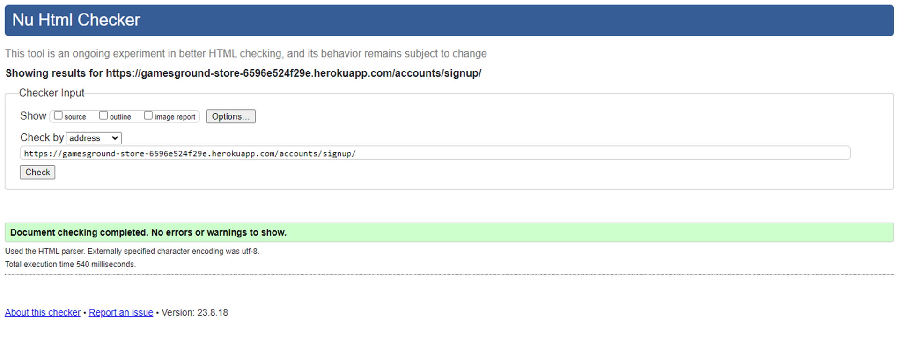
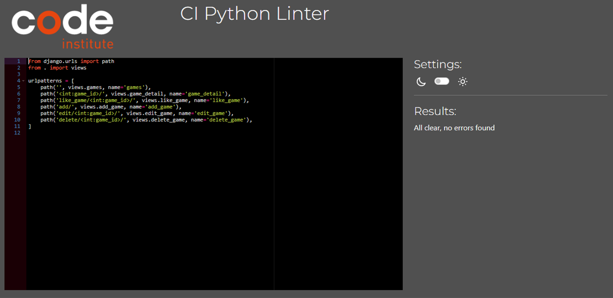
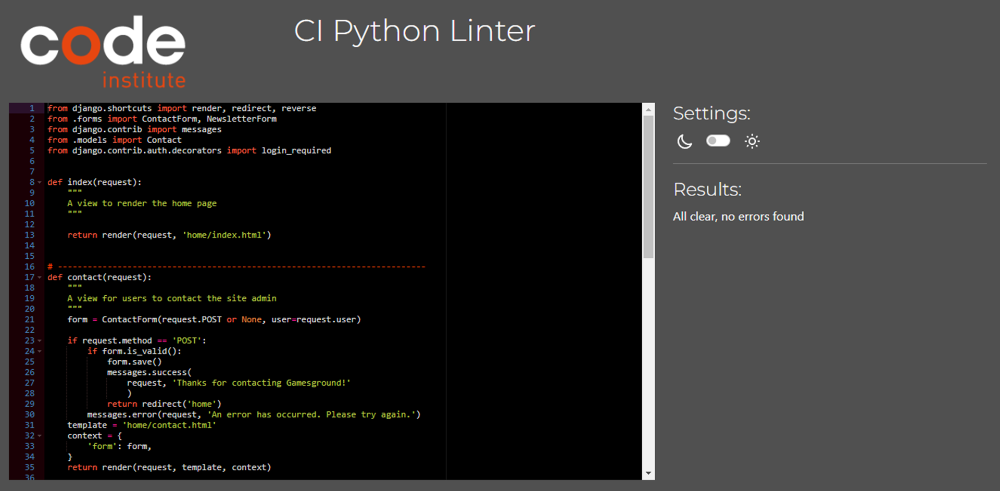
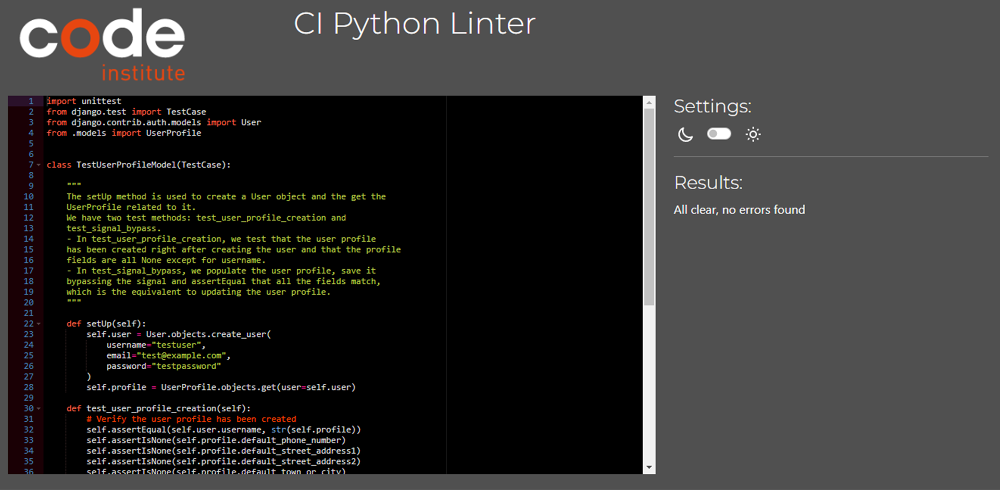

# Testing

Return back to the [README.md](README.md) file.

## Code Validation

In this section I ran validation for all the code I produced in the project. I found bugs in the code and fixed them, in order for it to work optimally and pass the tests.

### HTML

I have used the recommended [HTML W3C Validator](https://validator.w3.org) to validate all of my HTML files.

| Page | W3C URL | Before Screenshot | After Screenshot | Notes |
| --- | --- | --- | --- | --- |
| Index/Home | [W3C](https://validator.w3.org/nu/?doc=https%3A%2F%2Fgamesground-store-6596e524f29e.herokuapp.com%2F) |  |  | meta content ie has to be IE to be acceptable, ul can't be a child of menu element since menu substitutes ul, Bad value href in urls as they can't contain empty spaces (used %20 filler to resolve), stray closing i tag, unnecessary type attribute, h1 not used at top level (changed for h2), all fixed. |
| Register | [W3C](https://validator.w3.org/nu/?doc=https%3A%2F%2Fgamesground-store-6596e524f29e.herokuapp.com%2Faccounts%2Fsignup%2F) |  |  | Misuse of aria labels on div elements, fixed. |
| Login | [W3C](https://validator.w3.org/nu/?doc=https%3A%2F%2Fgamesground-store-6596e524f29e.herokuapp.com%2Faccounts%2Flogin%2F) |  |  | Passed no errors. |
| Games | [W3C](https://validator.w3.org/nu/?doc=https%3A%2F%2Fgamesground-store-6596e524f29e.herokuapp.com%2Fgames%2F%3Fplatform%3DPS5%2CPS4%2CXBOX%2520ONE%2CXBOX%2520SERIES%2520X%2FS%2CNINTENDO%2520SWITCH%2CPC) |  |  | Passed no errors. |
| Games by Platform | [W3C](https://validator.w3.org/nu/?doc=https%3A%2F%2Fgamesground-store-6596e524f29e.herokuapp.com%2Fgames%2F%3Fplatform%3DXBOX%2520ONE) |  |  | Passed no errors. |
| Games by Genre | [W3C](https://validator.w3.org/nu/?doc=https%3A%2F%2Fgamesground-store-6596e524f29e.herokuapp.com%2Fgames%2F%3Fgenre%3DHorror) |  |  | Passed no errors. |
| Games by Pegi | [W3C](https://validator.w3.org/nu/?doc=https%3A%2F%2Fgamesground-store-6596e524f29e.herokuapp.com%2Fgames%2F%3Fpegi_rating%3D12) |  |  | Passed no errors. |
| Games as Admin | [W3C](https://validator.w3.org/nu/?doc=https%3A%2F%2Fgamesground-store-6596e524f29e.herokuapp.com%2Fgames%2F%3Fplatform%3DPS5%2CPS4%2CXBOX%2520ONE%2CXBOX%2520SERIES%2520X%2FS%2CNINTENDO%2520SWITCH%2CPC) |  |  | This test had to be validated by input since pages that require a user to be logged-in and authenticated (CRUD functionality), will not work using uri validation method, due to the fact that the HTML Validator (W3C) doesn't have access to login to the pages. |
| Game Detail | [W3C](https://validator.w3.org/nu/?doc=https%3A%2F%2Fgamesground-store-6596e524f29e.herokuapp.com%2Fgames%2F32%2F) |  |  | For this particular page, I did extensive research on how to remove the framborder attribute, however I came to the conclusion that even though I effectively managed to remove the attribute using JavaScript as it can be noted in the screenshot, the validator still sees it, since it is an attribute from an element(iframe) generated dynamically from a third party library(Django embed video), there is nothing I can do to fix it, I even consulted with Code Institute tutor support and the conclusion was the same. |
| Game Detail as Admin | [W3C](https://validator.w3.org/nu/?doc=https%3A%2F%2Fgamesground-store-6596e524f29e.herokuapp.com%2Fgames%2F32%2F) |  |  | This test had to be validated by input same as games as admin. |
| About-Us | [W3C](https://validator.w3.org/nu/?doc=https%3A%2F%2Fgamesground-store-6596e524f29e.herokuapp.com%2Fabout_us%2F) |  |  | Passed no errors. |
| Contact-Us | [W3C](https://validator.w3.org/nu/?doc=https%3A%2F%2Fgamesground-store-6596e524f29e.herokuapp.com%2Fcontact%2F) |  |  | Passed no errors. |
| Contact-Us List | [W3C](https://validator.w3.org/nu/?doc=https%3A%2F%2Fgamesground-store-6596e524f29e.herokuapp.com%2Faccounts%2Flogin%2F%3Fnext%3D%2Fcontact_list%2F) |  |  | This test had to be validated by input same as games as admin, passed no errors. |
| Add Game | [W3C](https://validator.w3.org/nu/?doc=https%3A%2F%2Fgamesground-store-6596e524f29e.herokuapp.com%2Fgames%2Fadd%2F) |  |  | Error duplicate attribute class, duplicate attribute id, p element not allowed as child of strong tag, To fix these issues I did the following: Because classes 'border-black rounded' were being added to all fields in the form(in forms.py) I had to adjust the for loop to exclude the genre field given that genre field already came with an added class 'form-check-label'. As for the duplicate id attribute in the image field because we were using an id 'new-image' to carry out the JS function, it conflicted with an already existent id 'id_image', to resolve this I added a class to the input and targeted the element using data-img-target instead, changing the JS function accordingly, once I added the class, it also confilcted due to the 'border-black rounded' classes coming from forms.py so I also excluded the field from the for loop in forms.py. As for the strong tag being a parent of the p element, I simply eliminated the strong tag and created the same effect on the p element using bootstrap instead, this test had to be validated by input same as games as admin, all fixed. The HTML validator operates by requesting the given URL and then parsing the HTML content of that URL. If the URL provided requires authentication or specific user roles (like being a superuser) to access, the validator might not be able to retrieve the complete HTML content. As a result, the validator might encounter incomplete or restricted content, leading to false positives or warnings that might not accurately represent the actual HTML structure. Since the URL provided requires superuser access and involves CRUD functionality for the game objects, it's possible that the HTML validator is unable to fully retrieve and parse the HTML content. This could lead to inaccurate or misleading warnings, it's reasonable to assume that the 'Info: Trailing slash on void elements has no effect and interacts badly with unquoted attribute values' from the HTML validator is a result of its limitations in handling restricted or authenticated content when validating by URI |
| Edit Game | [W3C](https://validator.w3.org/nu/?doc=https%3A%2F%2Fgamesground-store-6596e524f29e.herokuapp.com%2Faccounts%2Flogin%2F%3Fnext%3D%2Fgames%2Fedit%2F29%2F) |  |  | This test had to be validated by input same as add game, passed no errors. 'Info: Trailing slash on void elements has no effect and interacts badly with unquoted attribute values' same as with Add game. |
| Delete Game | [W3C](https://validator.w3.org/nu/?doc=https%3A%2F%2Fgamesground-store-6596e524f29e.herokuapp.com%2Faccounts%2Flogin%2F%3Fnext%3D%2Fgames%2Fdelete%2F28%2F) |  |  | This test had to be validated by input same as add game, passed no errors. 'Info: Trailing slash on void elements has no effect and interacts badly with unquoted attribute values' same as with Add game. |
| Logout | [W3C](https://validator.w3.org/nu/?doc=https%3A%2F%2Fgamesground-store-6596e524f29e.herokuapp.com%2F) |  |  | This test had to be validated by input same as add game, passed no errors. |
| Newsletter | [W3C](https://validator.w3.org/nu/?doc=https%3A%2F%2Fgamesground-store-6596e524f29e.herokuapp.com%2Fnewsletter%2F) |  |  | Passed no errors. |
| Shooping Basket | [W3C](https://validator.w3.org/nu/?doc=https%3A%2F%2Fgamesground-store-6596e524f29e.herokuapp.com%2Fbasket%2F) |  |  | Bad value href in urls as they can't contain empty spaces (used %20 filler to resolve). The unclosed div elements error I resolved by moving the  statement outside of the row, given that when inside it, it was creating divs whether there were games in the basket or not. As for the duplicate ids error, since I have one html basket code for mobile and one for bigger screens, the id used in the button to remove item was duplicated, to resolve this I changed the id="remove_{{ item.game_id }}" for data-game-id="{{ item.game_id }}" and adjusted the JS code accordingly to target data instead of id, all fixed. |
| Checkout | [W3C](https://validator.w3.org/nu/?doc=https%3A%2F%2Fgamesground-store-6596e524f29e.herokuapp.com%2Fcheckout%2F) |  |  | Passed no errors. |
| Checkout Success | [W3C](https://validator.w3.org/nu/?doc=https%3A%2F%2Fgamesground-store-6596e524f29e.herokuapp.com%2Fcheckout%2Fcheckout_success%2FD280C480222641609B4B2CDDDF85B293) |  |  | Passed no errors. |
| Profile | [W3C](https://validator.w3.org/nu/?doc=https%3A%2F%2Fgamesground-store-6596e524f29e.herokuapp.com%2Faccounts%2Flogin%2F%3Fnext%3D%2Fprofile%2F) |  |  | This test had to be validated by input same as add game, passed no errors. 'Info: Trailing slash on void elements has no effect and interacts badly with unquoted attribute values' same as with Add game. |
| Order history | [W3C](https://validator.w3.org/nu/?doc=https%3A%2F%2Fgamesground-store-6596e524f29e.herokuapp.com%2Fprofile%2Forder_history%2F3C1076528AFF488A824BFC62CC7912E5) |  |  | This test had to be validated by input same as profile, passed no errors. |

### CSS

I have used the recommended [CSS Jigsaw Validator](https://jigsaw.w3.org/css-validator) to validate all of my CSS files.

| File | Jigsaw URL | Before Screenshot | After Screenshot | Notes |
| --- | --- | --- | --- | --- |
| base.css | [Jigsaw](https://jigsaw.w3.org/css-validator/validator?uri=https%3A%2F%2Fgamesground-store-6596e524f29e.herokuapp.com%2F&profile=css3svg&usermedium=all&warning=1&vextwarning=&lang=en#warnings) |  |  | The warnings shown are the result of using AWS and Bootstrap, passed no errors. |
| checkout.css | [Jigsaw](https://jigsaw.w3.org/css-validator/validator?uri=https%3A%2F%2Fgamesground-store-6596e524f29e.herokuapp.com%2Fcheckout%2F&profile=css3svg&usermedium=all&warning=1&vextwarning=&lang=en) |  |  | The warnings shown are the result of using AWS and Bootstrap, since this is an extra css file besides the base css it was tested both by input and by uri, passed no errors. |
| profile.css | [Jigsaw](https://jigsaw.w3.org/css-validator/validator?uri=https%3A%2F%2Fgamesground-store-6596e524f29e.herokuapp.com%2Fprofile%2F&profile=css3svg&usermedium=all&warning=1&vextwarning=&lang=en) |  |  | The warnings shown are the result of using AWS and Bootstrap, since this is an extra css file besides the base css it was tested both by input and by uri, passed no errors. |

### JavaScript

I have used the recommended [JShint Validator](https://jshint.com) to validate all of my JS files.

| File | Screenshot | Notes |
| --- | --- | --- |
| stripe_elements.js |  | Undefined Stripe variable |

### Python

I have used the recommended [CI Python Linter](https://pep8ci.herokuapp.com) to validate all of my Python files.

| File | CI URL | Before Screenshot | After Screenshot | Notes |
| --- | --- | --- | --- | --- |
| Gamesground Store *settings.py* | [CI PEP8](https://pep8ci.herokuapp.com/https://raw.githubusercontent.com/leonardo-simeone/gamesground-store/main/gamesground_store/settings.py) |  |  | E501 line too long errors, added noqa where lines of code could not be broken, all fixed. |
| Games *admin.py* | [CI PEP8](https://pep8ci.herokuapp.com/https://raw.githubusercontent.com/leonardo-simeone/gamesground-store/main/games/admin.py) |  |  | E501 line too long error, fixed. |
| Games *urls.py* | [CI PEP8](https://pep8ci.herokuapp.com/https://raw.githubusercontent.com/leonardo-simeone/gamesground-store/main/games/urls.py) |  |  | Passed no errors. |
| Games *models.py* | [CI PEP8](https://pep8ci.herokuapp.com/https://raw.githubusercontent.com/leonardo-simeone/gamesground-store/main/games/models.py) |  |  | E501 line too long errors, all fixed. |
| Games *forms.py* | [CI PEP8](https://pep8ci.herokuapp.com/https://raw.githubusercontent.com/leonardo-simeone/gamesground-store/main/games/forms.py) |  |  | E501 line too long error, fixed. |
| Games *views.py* | [CI PEP8](https://pep8ci.herokuapp.com/https://raw.githubusercontent.com/leonardo-simeone/gamesground-store/main/games/views.py) |  |  | E501 line too long errors, all fixed. |
| Games *widgets.py* | [CI PEP8](https://pep8ci.herokuapp.com/https://raw.githubusercontent.com/leonardo-simeone/gamesground-store/main/games/widgets.py) |  |  | E501 line too long error, fixed. |
| Games *url_filter.py* | [CI PEP8](https://pep8ci.herokuapp.com/https://raw.githubusercontent.com/leonardo-simeone/gamesground-store/main/games/templatetags/url_filter.py) |  |  | Passed no errors. |
| Games *test_urls.py* | [CI PEP8](https://pep8ci.herokuapp.com/https://raw.githubusercontent.com/leonardo-simeone/gamesground-store/main/games/test_urls.py) |  |  | Passed no errors. |
| Games *test_models.py* | [CI PEP8](https://pep8ci.herokuapp.com/https://raw.githubusercontent.com/leonardo-simeone/gamesground-store/main/games/test_models.py) |  |  | Passed no errors. |
| Games *test_forms.py* | [CI PEP8](https://pep8ci.herokuapp.com/https://raw.githubusercontent.com/leonardo-simeone/gamesground-store/main/games/test_forms.py) |  |  | Passed no errors. |
| Games *test_views.py* | [CI PEP8](https://pep8ci.herokuapp.com/https://raw.githubusercontent.com/leonardo-simeone/gamesground-store/main/games/test_views.py) |  |  | Passed no errors. |
| Games *test_widgets.py* | [CI PEP8](https://pep8ci.herokuapp.com/https://raw.githubusercontent.com/leonardo-simeone/gamesground-store/main/games/test_widgets.py) |  |  | Passed no errors. |
| Home *admin.py* | [CI PEP8](https://pep8ci.herokuapp.com/https://raw.githubusercontent.com/leonardo-simeone/gamesground-store/main/home/admin.py) |  |  | Passed no errors. |
| Home *urls.py* | [CI PEP8](https://pep8ci.herokuapp.com/https://raw.githubusercontent.com/leonardo-simeone/gamesground-store/main/home/urls.py) |  |  | Passed no errors. |
| Home *models.py* | [CI PEP8](https://pep8ci.herokuapp.com/https://raw.githubusercontent.com/leonardo-simeone/gamesground-store/main/home/models.py) |  |  | Passed no errors. |
| Home *forms.py* | [CI PEP8](https://pep8ci.herokuapp.com/https://raw.githubusercontent.com/leonardo-simeone/gamesground-store/main/home/forms.py) |  |  | Passed no errors. |
| Home *views.py* | [CI PEP8](https://pep8ci.herokuapp.com/https://raw.githubusercontent.com/leonardo-simeone/gamesground-store/main/home/views.py) |  |  | Passed no errors. |
| Home *contact_count.py* | [CI PEP8](https://pep8ci.herokuapp.com/https://raw.githubusercontent.com/leonardo-simeone/gamesground-store/main/home/contact_count.py) |  |  | Passed no errors. |
| Home *test_urls.py* | [CI PEP8](https://pep8ci.herokuapp.com/https://raw.githubusercontent.com/leonardo-simeone/gamesground-store/main/home/test_urls.py) |  |  | Passed no errors. |
| Home *test_models.py* | [CI PEP8](https://pep8ci.herokuapp.com/https://raw.githubusercontent.com/leonardo-simeone/gamesground-store/main/home/test_models.py) |  |  | E501 line too long error, fixed. |
| Home *test_forms.py* | [CI PEP8](https://pep8ci.herokuapp.com/https://raw.githubusercontent.com/leonardo-simeone/gamesground-store/main/home/test_forms.py) |  |  | Passed no errors. |
| Home *test_views.py* | [CI PEP8](https://pep8ci.herokuapp.com/https://raw.githubusercontent.com/leonardo-simeone/gamesground-store/main/home/test_views.py) |  |  | Passed no errors. |
| Home *test_contact_count.py* | [CI PEP8](https://pep8ci.herokuapp.com/https://raw.githubusercontent.com/leonardo-simeone/gamesground-store/main/home/test_contact_count.py) |  |  | Passed no errors. |
| Basket *urls.py* | [CI PEP8](https://pep8ci.herokuapp.com/https://raw.githubusercontent.com/leonardo-simeone/gamesground-store/main/basket/urls.py) |  |  | E501 line too long error, fixed. |
| Basket *views.py* | [CI PEP8](https://pep8ci.herokuapp.com/https://raw.githubusercontent.com/leonardo-simeone/gamesground-store/main/basket/views.py) |  |  | Passed no errors. |
| Basket *contexts.py* | [CI PEP8](https://pep8ci.herokuapp.com/https://raw.githubusercontent.com/leonardo-simeone/gamesground-store/main/basket/contexts.py) |  |  | Passed no errors. |
| Basket *basket_tools.py* | [CI PEP8](https://pep8ci.herokuapp.com/https://raw.githubusercontent.com/leonardo-simeone/gamesground-store/main/basket/templatetags/basket_tools.py) |  |  | Passed no errors. |
| Checkout *admin.py* | [CI PEP8](https://pep8ci.herokuapp.com/https://raw.githubusercontent.com/leonardo-simeone/gamesground-store/main/checkout/admin.py) |  |  | Passed no errors. |
| Checkout *urls.py* | [CI PEP8](https://pep8ci.herokuapp.com/https://raw.githubusercontent.com/leonardo-simeone/gamesground-store/main/checkout/urls.py) |  |  | E501 line too long error, fixed. |
| Checkout *models.py* | [CI PEP8](https://pep8ci.herokuapp.com/https://raw.githubusercontent.com/leonardo-simeone/gamesground-store/main/checkout/models.py) |  |  | E501 line too long errors, all fixed. |
| Checkout *forms.py* | [CI PEP8](https://pep8ci.herokuapp.com/https://raw.githubusercontent.com/leonardo-simeone/gamesground-store/main/checkout/forms.py) |  |  | Passed no errors. |
| Checkout *views.py* | [CI PEP8](https://pep8ci.herokuapp.com/https://raw.githubusercontent.com/leonardo-simeone/gamesground-store/main/checkout/views.py) |  |  | E501 line too long errors, all fixed. |
| Checkout *signals.py* | [CI PEP8](https://pep8ci.herokuapp.com/https://raw.githubusercontent.com/leonardo-simeone/gamesground-store/main/checkout/signals.py) |  |  | Passed no errors. |
| Checkout *test_urls.py* | [CI PEP8](https://pep8ci.herokuapp.com/https://raw.githubusercontent.com/leonardo-simeone/gamesground-store/main/checkout/test_urls.py) |  |  | Passed no errors. |
| Checkout *test_models.py* | [CI PEP8](https://pep8ci.herokuapp.com/https://raw.githubusercontent.com/leonardo-simeone/gamesground-store/main/checkout/test_models.py) |  |  | Passed no errors. |
| Checkout *test_forms.py* | [CI PEP8](https://pep8ci.herokuapp.com/https://raw.githubusercontent.com/leonardo-simeone/gamesground-store/main/checkout/test_forms.py) |  |  | Passed no errors. |
| Checkout *test_views.py* | [CI PEP8](https://pep8ci.herokuapp.com/https://raw.githubusercontent.com/leonardo-simeone/gamesground-store/main/checkout/test_views.py) |  |  | Passed no errors. |
| Checkout *test_signals.py* | [CI PEP8](https://pep8ci.herokuapp.com/https://raw.githubusercontent.com/leonardo-simeone/gamesground-store/main/checkout/test_signals.py) |  |  | Passed no errors. |
| Profiles *urls.py* | [CI PEP8](https://pep8ci.herokuapp.com/https://raw.githubusercontent.com/leonardo-simeone/gamesground-store/main/profiles/urls.py) |  |  | E501 line too long error, fixed. |
| Profiles *models.py* | [CI PEP8](https://pep8ci.herokuapp.com/https://raw.githubusercontent.com/leonardo-simeone/gamesground-store/main/profiles/models.py) |  |  | E501 line too long errors, all fixed. |
| Profiles *forms.py* | [CI PEP8](https://pep8ci.herokuapp.com/https://raw.githubusercontent.com/leonardo-simeone/gamesground-store/main/profiles/forms.py) |  |  | Passed no errors. |
| Profiles *views.py* | [CI PEP8](https://pep8ci.herokuapp.com/https://raw.githubusercontent.com/leonardo-simeone/gamesground-store/main/profiles/views.py) |  |  | E501 line too long error, fixed. |
| Profiles *test_urls.py* | [CI PEP8](https://pep8ci.herokuapp.com/https://raw.githubusercontent.com/leonardo-simeone/gamesground-store/main/profiles/test_urls.py) |  |  | Passed no errors. |
| Profiles *test_models.py* | [CI PEP8](https://pep8ci.herokuapp.com/https://raw.githubusercontent.com/leonardo-simeone/gamesground-store/main/profiles/test_models.py) |  |  | Passed no errors. |
| Profiles *test_forms.py* | [CI PEP8](https://pep8ci.herokuapp.com/https://raw.githubusercontent.com/leonardo-simeone/gamesground-store/main/profiles/test_forms.py) |  |  | Passed no errors. |
| Profiles *test_views.py* | [CI PEP8](https://pep8ci.herokuapp.com/https://raw.githubusercontent.com/leonardo-simeone/gamesground-store/main/profiles/test_views.py) |  |  | Passed no errors. |

## Browser Compatibility

I've tested my deployed project on multiple browsers to check for compatibility issues.

| Browser | Screenshot | Notes |
| --- | --- | --- |
| Chrome |  | Works as expected |
| Edge |  | Works as expected |
| Firefox |  | Works as expected |

## Responsiveness

I've tested my deployed project on multiple devices to check for responsiveness issues.

| Device | Screenshot | Notes |
| --- | --- | --- |
| Mobile (DevTools) |  | Works as expected |
| Tablet (DevTools) |  | Works as expected |
| Desktop (DevTools) |  | Works as expected |
| XL Monitor |  | Works as expected |
| 4K Monitor |  | Works as expected |
| Samsung Galaxy A52s (my own phone) |  | Works as expected |

