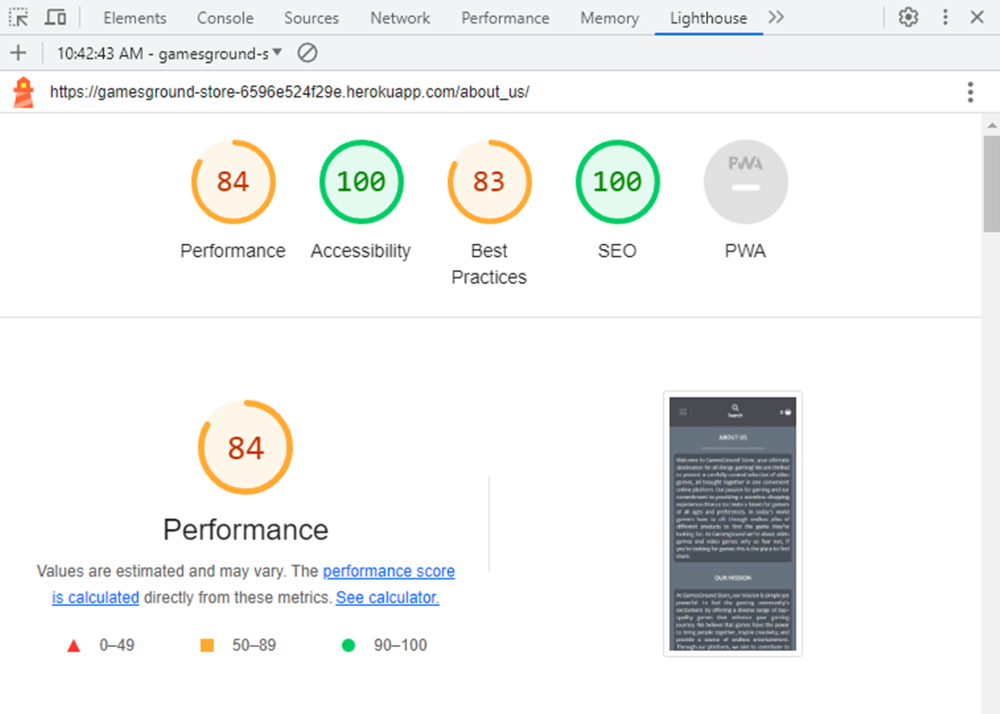
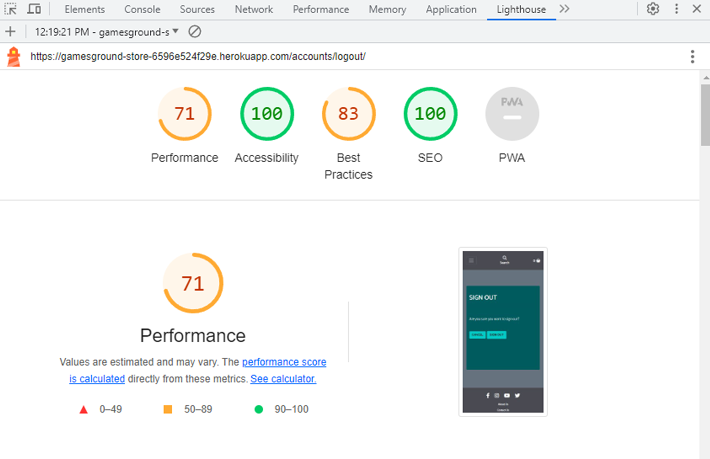

# Testing

Return back to the [README.md](README.md) file.

## Code Validation

In this section I ran validation for all the code I produced in the project. I found bugs in the code and fixed them, in order for it to work optimally and pass the tests.

### HTML

I have used the recommended [HTML W3C Validator](https://validator.w3.org) to validate all of my HTML files.

| Page | W3C URL | Before Screenshot | After Screenshot | Notes |
| --- | --- | --- | --- | --- |
| Index/Home | [W3C](https://validator.w3.org/nu/?doc=https%3A%2F%2Fgamesground-store-6596e524f29e.herokuapp.com%2F) |  |  | meta content ie has to be IE to be acceptable, ul can't be a child of menu element since menu substitutes ul, Bad value href in urls as they can't contain empty spaces (used %20 filler to resolve), stray closing i tag, unnecessary type attribute, h1 not used at top level (changed for h2), all fixed. |
| Register | [W3C](https://validator.w3.org/nu/?doc=https%3A%2F%2Fgamesground-store-6596e524f29e.herokuapp.com%2Faccounts%2Fsignup%2F) |  |  | Misuse of aria labels on div elements, fixed. |
| Login | [W3C](https://validator.w3.org/nu/?doc=https%3A%2F%2Fgamesground-store-6596e524f29e.herokuapp.com%2Faccounts%2Flogin%2F) |  |  | Passed no errors. |
| Games | [W3C](https://validator.w3.org/nu/?doc=https%3A%2F%2Fgamesground-store-6596e524f29e.herokuapp.com%2Fgames%2F%3Fplatform%3DPS5%2CPS4%2CXBOX%2520ONE%2CXBOX%2520SERIES%2520X%2FS%2CNINTENDO%2520SWITCH%2CPC) |  |  | Passed no errors. |
| Games by Platform | [W3C](https://validator.w3.org/nu/?doc=https%3A%2F%2Fgamesground-store-6596e524f29e.herokuapp.com%2Fgames%2F%3Fplatform%3DXBOX%2520ONE) |  |  | Passed no errors. |
| Games by Genre | [W3C](https://validator.w3.org/nu/?doc=https%3A%2F%2Fgamesground-store-6596e524f29e.herokuapp.com%2Fgames%2F%3Fgenre%3DHorror) |  |  | Passed no errors. |
| Games by Pegi | [W3C](https://validator.w3.org/nu/?doc=https%3A%2F%2Fgamesground-store-6596e524f29e.herokuapp.com%2Fgames%2F%3Fpegi_rating%3D12) |  |  | Passed no errors. |
| Games as Admin | [W3C](https://validator.w3.org/nu/?doc=https%3A%2F%2Fgamesground-store-6596e524f29e.herokuapp.com%2Fgames%2F%3Fplatform%3DPS5%2CPS4%2CXBOX%2520ONE%2CXBOX%2520SERIES%2520X%2FS%2CNINTENDO%2520SWITCH%2CPC) |  |  | This test had to be validated by input since pages that require a user to be logged-in and authenticated (CRUD functionality), will not work using uri validation method, due to the fact that the HTML Validator (W3C) doesn't have access to login to the pages. |
| Game Detail | [W3C](https://validator.w3.org/nu/?doc=https%3A%2F%2Fgamesground-store-6596e524f29e.herokuapp.com%2Fgames%2F32%2F) |  |  | For this particular page, I did extensive research on how to remove the framborder attribute, however I came to the conclusion that even though I effectively managed to remove the attribute using JavaScript as it can be noted in the screenshot, the validator still sees it, since it is an attribute from an element(iframe) generated dynamically from a third party library(Django embed video), there is nothing I can do to fix it, I even consulted with Code Institute tutor support and the conclusion was the same. |
| Game Detail as Admin | [W3C](https://validator.w3.org/nu/?doc=https%3A%2F%2Fgamesground-store-6596e524f29e.herokuapp.com%2Fgames%2F32%2F) |  |  | This test had to be validated by input same as games as admin. |
| About-Us | [W3C](https://validator.w3.org/nu/?doc=https%3A%2F%2Fgamesground-store-6596e524f29e.herokuapp.com%2Fabout_us%2F) |  |  | Passed no errors. |
| Contact-Us | [W3C](https://validator.w3.org/nu/?doc=https%3A%2F%2Fgamesground-store-6596e524f29e.herokuapp.com%2Fcontact%2F) |  |  | Passed no errors. |
| Contact-Us List | [W3C](https://validator.w3.org/nu/?doc=https%3A%2F%2Fgamesground-store-6596e524f29e.herokuapp.com%2Faccounts%2Flogin%2F%3Fnext%3D%2Fcontact_list%2F) |  |  | This test had to be validated by input same as games as admin, passed no errors. |
| Add Game | [W3C](https://validator.w3.org/nu/?doc=https%3A%2F%2Fgamesground-store-6596e524f29e.herokuapp.com%2Fgames%2Fadd%2F) |  |  | Error duplicate attribute class, duplicate attribute id, p element not allowed as child of strong tag, To fix these issues I did the following: Because classes 'border-black rounded' were being added to all fields in the form(in forms.py) I had to adjust the for loop to exclude the genre field given that genre field already came with an added class 'form-check-label'. As for the duplicate id attribute in the image field because we were using an id 'new-image' to carry out the JS function, it conflicted with an already existent id 'id_image', to resolve this I added a class to the input and targeted the element using data-img-target instead, changing the JS function accordingly, once I added the class, it also confilcted due to the 'border-black rounded' classes coming from forms.py so I also excluded the field from the for loop in forms.py. As for the strong tag being a parent of the p element, I simply eliminated the strong tag and created the same effect on the p element using bootstrap instead, this test had to be validated by input same as games as admin, all fixed. The HTML validator operates by requesting the given URL and then parsing the HTML content of that URL. If the URL provided requires authentication or specific user roles (like being a superuser) to access, the validator might not be able to retrieve the complete HTML content. As a result, the validator might encounter incomplete or restricted content, leading to false positives or warnings that might not accurately represent the actual HTML structure. Since the URL provided requires superuser access and involves CRUD functionality for the game objects, it's possible that the HTML validator is unable to fully retrieve and parse the HTML content. This could lead to inaccurate or misleading warnings, it's reasonable to assume that the 'Info: Trailing slash on void elements has no effect and interacts badly with unquoted attribute values' from the HTML validator is a result of its limitations in handling restricted or authenticated content when validating by URI |
| Edit Game | [W3C](https://validator.w3.org/nu/?doc=https%3A%2F%2Fgamesground-store-6596e524f29e.herokuapp.com%2Faccounts%2Flogin%2F%3Fnext%3D%2Fgames%2Fedit%2F29%2F) |  |  | This test had to be validated by input same as add game, passed no errors. 'Info: Trailing slash on void elements has no effect and interacts badly with unquoted attribute values' same as with Add game. |
| Delete Game | [W3C](https://validator.w3.org/nu/?doc=https%3A%2F%2Fgamesground-store-6596e524f29e.herokuapp.com%2Faccounts%2Flogin%2F%3Fnext%3D%2Fgames%2Fdelete%2F28%2F) |  |  | This test had to be validated by input same as add game, passed no errors. 'Info: Trailing slash on void elements has no effect and interacts badly with unquoted attribute values' same as with Add game. |
| Logout | [W3C](https://validator.w3.org/nu/?doc=https%3A%2F%2Fgamesground-store-6596e524f29e.herokuapp.com%2F) |  |  | This test had to be validated by input same as add game, passed no errors. |
| Newsletter | [W3C](https://validator.w3.org/nu/?doc=https%3A%2F%2Fgamesground-store-6596e524f29e.herokuapp.com%2Fnewsletter%2F) |  |  | Passed no errors. |
| Shooping Basket | [W3C](https://validator.w3.org/nu/?doc=https%3A%2F%2Fgamesground-store-6596e524f29e.herokuapp.com%2Fbasket%2F) |  |  | Bad value href in urls as they can't contain empty spaces (used %20 filler to resolve). The unclosed div elements error I resolved by moving the  statement outside of the row, given that when inside it, it was creating divs whether there were games in the basket or not. As for the duplicate ids error, since I have one html basket code for mobile and one for bigger screens, the id used in the button to remove item was duplicated, to resolve this I changed the id="remove_{{ item.game_id }}" for data-game-id="{{ item.game_id }}" and adjusted the JS code accordingly to target data instead of id, all fixed. |
| Checkout | [W3C](https://validator.w3.org/nu/?doc=https%3A%2F%2Fgamesground-store-6596e524f29e.herokuapp.com%2Fcheckout%2F) |  |  | Passed no errors. |
| Checkout Success | [W3C](https://validator.w3.org/nu/?doc=https%3A%2F%2Fgamesground-store-6596e524f29e.herokuapp.com%2Fcheckout%2Fcheckout_success%2FD280C480222641609B4B2CDDDF85B293) |  |  | Passed no errors. |
| Profile | [W3C](https://validator.w3.org/nu/?doc=https%3A%2F%2Fgamesground-store-6596e524f29e.herokuapp.com%2Faccounts%2Flogin%2F%3Fnext%3D%2Fprofile%2F) |  |  | This test had to be validated by input same as add game, passed no errors. 'Info: Trailing slash on void elements has no effect and interacts badly with unquoted attribute values' same as with Add game. |
| Order history | [W3C](https://validator.w3.org/nu/?doc=https%3A%2F%2Fgamesground-store-6596e524f29e.herokuapp.com%2Fprofile%2Forder_history%2F3C1076528AFF488A824BFC62CC7912E5) |  |  | This test had to be validated by input same as profile, passed no errors. |

### CSS

I have used the recommended [CSS Jigsaw Validator](https://jigsaw.w3.org/css-validator) to validate all of my CSS files.

| File | Jigsaw URL | Before Screenshot | After Screenshot | Notes |
| --- | --- | --- | --- | --- |
| base.css | [Jigsaw](https://jigsaw.w3.org/css-validator/validator?uri=https%3A%2F%2Fgamesground-store-6596e524f29e.herokuapp.com%2F&profile=css3svg&usermedium=all&warning=1&vextwarning=&lang=en#warnings) |  |  | The warnings shown are the result of using AWS and Bootstrap, passed no errors. |
| checkout.css | [Jigsaw](https://jigsaw.w3.org/css-validator/validator?uri=https%3A%2F%2Fgamesground-store-6596e524f29e.herokuapp.com%2Fcheckout%2F&profile=css3svg&usermedium=all&warning=1&vextwarning=&lang=en) |  |  | The warnings shown are the result of using AWS and Bootstrap, since this is an extra css file besides the base css it was tested both by input and by uri, passed no errors. |
| profile.css | [Jigsaw](https://jigsaw.w3.org/css-validator/validator?uri=https%3A%2F%2Fgamesground-store-6596e524f29e.herokuapp.com%2Fprofile%2F&profile=css3svg&usermedium=all&warning=1&vextwarning=&lang=en) |  |  | The warnings shown are the result of using AWS and Bootstrap, since this is an extra css file besides the base css it was tested both by input and by uri, passed no errors. |

### JavaScript

I have used the recommended [JShint Validator](https://jshint.com) to validate all of my JS files.

| File | Screenshot | Notes |
| --- | --- | --- |
| stripe_elements.js |  | Undefined Stripe variable |

### Python

I have used the recommended [CI Python Linter](https://pep8ci.herokuapp.com) to validate all of my Python files.

| File | CI URL | Before Screenshot | After Screenshot | Notes |
| --- | --- | --- | --- | --- |
| Gamesground Store *settings.py* | [CI PEP8](https://pep8ci.herokuapp.com/https://raw.githubusercontent.com/leonardo-simeone/gamesground-store/main/gamesground_store/settings.py) |  |  | E501 line too long errors, added noqa where lines of code could not be broken, all fixed. |
| Games *admin.py* | [CI PEP8](https://pep8ci.herokuapp.com/https://raw.githubusercontent.com/leonardo-simeone/gamesground-store/main/games/admin.py) |  |  | E501 line too long error, fixed. |
| Games *urls.py* | [CI PEP8](https://pep8ci.herokuapp.com/https://raw.githubusercontent.com/leonardo-simeone/gamesground-store/main/games/urls.py) |  |  | Passed no errors. |
| Games *models.py* | [CI PEP8](https://pep8ci.herokuapp.com/https://raw.githubusercontent.com/leonardo-simeone/gamesground-store/main/games/models.py) |  |  | E501 line too long errors, all fixed. |
| Games *forms.py* | [CI PEP8](https://pep8ci.herokuapp.com/https://raw.githubusercontent.com/leonardo-simeone/gamesground-store/main/games/forms.py) |  |  | E501 line too long error, fixed. |
| Games *views.py* | [CI PEP8](https://pep8ci.herokuapp.com/https://raw.githubusercontent.com/leonardo-simeone/gamesground-store/main/games/views.py) |  |  | E501 line too long errors, all fixed. |
| Games *widgets.py* | [CI PEP8](https://pep8ci.herokuapp.com/https://raw.githubusercontent.com/leonardo-simeone/gamesground-store/main/games/widgets.py) |  |  | E501 line too long error, fixed. |
| Games *url_filter.py* | [CI PEP8](https://pep8ci.herokuapp.com/https://raw.githubusercontent.com/leonardo-simeone/gamesground-store/main/games/templatetags/url_filter.py) |  |  | Passed no errors. |
| Games *test_urls.py* | [CI PEP8](https://pep8ci.herokuapp.com/https://raw.githubusercontent.com/leonardo-simeone/gamesground-store/main/games/test_urls.py) |  |  | Passed no errors. |
| Games *test_models.py* | [CI PEP8](https://pep8ci.herokuapp.com/https://raw.githubusercontent.com/leonardo-simeone/gamesground-store/main/games/test_models.py) |  |  | Passed no errors. |
| Games *test_forms.py* | [CI PEP8](https://pep8ci.herokuapp.com/https://raw.githubusercontent.com/leonardo-simeone/gamesground-store/main/games/test_forms.py) |  |  | Passed no errors. |
| Games *test_views.py* | [CI PEP8](https://pep8ci.herokuapp.com/https://raw.githubusercontent.com/leonardo-simeone/gamesground-store/main/games/test_views.py) |  |  | Passed no errors. |
| Games *test_widgets.py* | [CI PEP8](https://pep8ci.herokuapp.com/https://raw.githubusercontent.com/leonardo-simeone/gamesground-store/main/games/test_widgets.py) |  |  | Passed no errors. |
| Home *admin.py* | [CI PEP8](https://pep8ci.herokuapp.com/https://raw.githubusercontent.com/leonardo-simeone/gamesground-store/main/home/admin.py) |  |  | Passed no errors. |
| Home *urls.py* | [CI PEP8](https://pep8ci.herokuapp.com/https://raw.githubusercontent.com/leonardo-simeone/gamesground-store/main/home/urls.py) |  |  | Passed no errors. |
| Home *models.py* | [CI PEP8](https://pep8ci.herokuapp.com/https://raw.githubusercontent.com/leonardo-simeone/gamesground-store/main/home/models.py) |  |  | Passed no errors. |
| Home *forms.py* | [CI PEP8](https://pep8ci.herokuapp.com/https://raw.githubusercontent.com/leonardo-simeone/gamesground-store/main/home/forms.py) |  |  | Passed no errors. |
| Home *views.py* | [CI PEP8](https://pep8ci.herokuapp.com/https://raw.githubusercontent.com/leonardo-simeone/gamesground-store/main/home/views.py) |  |  | Passed no errors. |
| Home *contact_count.py* | [CI PEP8](https://pep8ci.herokuapp.com/https://raw.githubusercontent.com/leonardo-simeone/gamesground-store/main/home/contact_count.py) |  |  | Passed no errors. |
| Home *test_urls.py* | [CI PEP8](https://pep8ci.herokuapp.com/https://raw.githubusercontent.com/leonardo-simeone/gamesground-store/main/home/test_urls.py) |  |  | Passed no errors. |
| Home *test_models.py* | [CI PEP8](https://pep8ci.herokuapp.com/https://raw.githubusercontent.com/leonardo-simeone/gamesground-store/main/home/test_models.py) |  |  | E501 line too long error, fixed. |
| Home *test_forms.py* | [CI PEP8](https://pep8ci.herokuapp.com/https://raw.githubusercontent.com/leonardo-simeone/gamesground-store/main/home/test_forms.py) |  |  | Passed no errors. |
| Home *test_views.py* | [CI PEP8](https://pep8ci.herokuapp.com/https://raw.githubusercontent.com/leonardo-simeone/gamesground-store/main/home/test_views.py) |  |  | Passed no errors. |
| Home *test_contact_count.py* | [CI PEP8](https://pep8ci.herokuapp.com/https://raw.githubusercontent.com/leonardo-simeone/gamesground-store/main/home/test_contact_count.py) |  |  | Passed no errors. |
| Basket *urls.py* | [CI PEP8](https://pep8ci.herokuapp.com/https://raw.githubusercontent.com/leonardo-simeone/gamesground-store/main/basket/urls.py) |  |  | E501 line too long error, fixed. |
| Basket *views.py* | [CI PEP8](https://pep8ci.herokuapp.com/https://raw.githubusercontent.com/leonardo-simeone/gamesground-store/main/basket/views.py) |  |  | Passed no errors. |
| Basket *contexts.py* | [CI PEP8](https://pep8ci.herokuapp.com/https://raw.githubusercontent.com/leonardo-simeone/gamesground-store/main/basket/contexts.py) |  |  | Passed no errors. |
| Basket *basket_tools.py* | [CI PEP8](https://pep8ci.herokuapp.com/https://raw.githubusercontent.com/leonardo-simeone/gamesground-store/main/basket/templatetags/basket_tools.py) |  |  | Passed no errors. |
| Checkout *admin.py* | [CI PEP8](https://pep8ci.herokuapp.com/https://raw.githubusercontent.com/leonardo-simeone/gamesground-store/main/checkout/admin.py) |  |  | Passed no errors. |
| Checkout *urls.py* | [CI PEP8](https://pep8ci.herokuapp.com/https://raw.githubusercontent.com/leonardo-simeone/gamesground-store/main/checkout/urls.py) |  |  | E501 line too long error, fixed. |
| Checkout *models.py* | [CI PEP8](https://pep8ci.herokuapp.com/https://raw.githubusercontent.com/leonardo-simeone/gamesground-store/main/checkout/models.py) |  |  | E501 line too long errors, all fixed. |
| Checkout *forms.py* | [CI PEP8](https://pep8ci.herokuapp.com/https://raw.githubusercontent.com/leonardo-simeone/gamesground-store/main/checkout/forms.py) |  |  | Passed no errors. |
| Checkout *views.py* | [CI PEP8](https://pep8ci.herokuapp.com/https://raw.githubusercontent.com/leonardo-simeone/gamesground-store/main/checkout/views.py) |  |  | E501 line too long errors, all fixed. |
| Checkout *signals.py* | [CI PEP8](https://pep8ci.herokuapp.com/https://raw.githubusercontent.com/leonardo-simeone/gamesground-store/main/checkout/signals.py) |  |  | Passed no errors. |
| Checkout *test_urls.py* | [CI PEP8](https://pep8ci.herokuapp.com/https://raw.githubusercontent.com/leonardo-simeone/gamesground-store/main/checkout/test_urls.py) |  |  | Passed no errors. |
| Checkout *test_models.py* | [CI PEP8](https://pep8ci.herokuapp.com/https://raw.githubusercontent.com/leonardo-simeone/gamesground-store/main/checkout/test_models.py) |  |  | Passed no errors. |
| Checkout *test_forms.py* | [CI PEP8](https://pep8ci.herokuapp.com/https://raw.githubusercontent.com/leonardo-simeone/gamesground-store/main/checkout/test_forms.py) |  |  | Passed no errors. |
| Checkout *test_views.py* | [CI PEP8](https://pep8ci.herokuapp.com/https://raw.githubusercontent.com/leonardo-simeone/gamesground-store/main/checkout/test_views.py) |  |  | Passed no errors. |
| Checkout *test_signals.py* | [CI PEP8](https://pep8ci.herokuapp.com/https://raw.githubusercontent.com/leonardo-simeone/gamesground-store/main/checkout/test_signals.py) |  |  | Passed no errors. |
| Profiles *urls.py* | [CI PEP8](https://pep8ci.herokuapp.com/https://raw.githubusercontent.com/leonardo-simeone/gamesground-store/main/profiles/urls.py) |  |  | E501 line too long error, fixed. |
| Profiles *models.py* | [CI PEP8](https://pep8ci.herokuapp.com/https://raw.githubusercontent.com/leonardo-simeone/gamesground-store/main/profiles/models.py) |  |  | E501 line too long errors, all fixed. |
| Profiles *forms.py* | [CI PEP8](https://pep8ci.herokuapp.com/https://raw.githubusercontent.com/leonardo-simeone/gamesground-store/main/profiles/forms.py) |  |  | Passed no errors. |
| Profiles *views.py* | [CI PEP8](https://pep8ci.herokuapp.com/https://raw.githubusercontent.com/leonardo-simeone/gamesground-store/main/profiles/views.py) |  |  | E501 line too long error, fixed. |
| Profiles *test_urls.py* | [CI PEP8](https://pep8ci.herokuapp.com/https://raw.githubusercontent.com/leonardo-simeone/gamesground-store/main/profiles/test_urls.py) |  |  | Passed no errors. |
| Profiles *test_models.py* | [CI PEP8](https://pep8ci.herokuapp.com/https://raw.githubusercontent.com/leonardo-simeone/gamesground-store/main/profiles/test_models.py) |  |  | Passed no errors. |
| Profiles *test_forms.py* | [CI PEP8](https://pep8ci.herokuapp.com/https://raw.githubusercontent.com/leonardo-simeone/gamesground-store/main/profiles/test_forms.py) |  |  | Passed no errors. |
| Profiles *test_views.py* | [CI PEP8](https://pep8ci.herokuapp.com/https://raw.githubusercontent.com/leonardo-simeone/gamesground-store/main/profiles/test_views.py) |  |  | Passed no errors. |

## Browser Compatibility

I've tested my deployed project on multiple browsers to check for compatibility issues.

| Browser | Screenshot | Notes |
| --- | --- | --- |
| Chrome |  | Works as expected |
| Edge |  | Works as expected |
| Firefox |  | Works as expected |

## Responsiveness

I've tested my deployed project on multiple devices to check for responsiveness issues.

| Device | Screenshot | Notes |
| --- | --- | --- |
| Mobile (DevTools) |  | Works as expected |
| Tablet (DevTools) |  | Works as expected |
| Desktop (DevTools) |  | Works as expected |
| XL Monitor |  | Works as expected |
| 4K Monitor |  | Works as expected |
| Samsung Galaxy A52s (my own phone) |  | Works as expected |

## Lighthouse Audit

I've tested my deployed project using the Lighthouse Audit tool to check for any major issues.

| Page | Mobile | Desktop | Notes |
| --- | --- | --- | --- |
| Home |  |  | Few warnings on mobile |
| About Us |  |  | Few warnings on mobile |
| Newsletter |  |  | Few warnings on mobile |
| Contact Us |  |  | Few warnings on mobile |
| Contact List |  |  | Few warnings on mobile |
| Games |  |  | Slow response time due to amount of images, few warnings |
| Game Detail |  |  | few warnings on mobile |
| Add Game |  |  | few warnings on mobile |
| Edit Game |  |  | few warnings on mobile and some minor warnings on desktop due to aspect ratio on game image |
| Delete Game |  |  | few warnings on mobile |
| Shopping Basket |  |  | few warnings on mobile |
| Register |  |  | few warnings on mobile |
| Login |  |  | few warnings on mobile |
| Logout |  |  | few warnings on mobile |
| Checkout |  |  | few warnings on mobile |
| Checkout Success |  |  | few warnings on mobile |
| Profile |  |  | few warnings on mobile |
| Order History |  |  | few warnings on mobile |

## Defensive Programming

Defensive programming was manually tested with the below user acceptance testing:

| Page | User Action | Expected Result | Pass/Fail | Comments |
| --- | --- | --- | --- | --- |
| Home Page | | | | |
| | Click on Logo | Redirection to Home page | Pass | |
| | Click on Home link in navbar | Redirection to Home page | Pass | |
| | Click on Home link in Sign in page | Redirection to Home page | Pass | |
| | Click on Cancel link in Logout page | Redirection to Home page | Pass | |
| | Search bar display in every page and functionality | Search bar is displayed in every page as expected and functionality works as expected | Pass | When the search bar is clicked on but no characters (no query) is input in it and enter is pressed or the magnifying glass icon is clicked or tapped on, an error message will be generated, indicating the user to do so in order to search |
| About Us Page | | | | |
| | Click on About Us link in navbar | Redirection to About Us page | Pass | |
| | Click on About Us link in footer | Redirection to About Us page | Pass | |
| Games Page | | | | |
| | Click on Shop now link in homepage Jumbotron | Redirection to All Games page showing all games for all platforms | Pass | |
| | Click on Playstation Games link in homepage | Redirection to Games page showing Playstation 4 and 5 Games | Pass | |
| | Click on Xbox Games link in homepage | Redirection to Games page showing Xbox one and Xbox Series x/s Games | Pass | |
| | Click on PC Games link in homepage | Redirection to Games page showing Playstation 4 and 5 Games | Pass | |
| | Click on Best prices in market info heading link in the bottom of homepage | Redirection to All Games page showing all games for all platforms | Pass | |
| | Click on each one of the platform options links in the dropdown menu for All Games in navbar | Redirection to Games page showing the games of the platform selected | Pass | |
| | Click on each one of the platform badges links in the All Games page | Redirection to Games page showing the games of the platform selected | Pass | |
| | Click on each one of the genre options links in the dropdown menu for Genre in navbar | Redirection to Games page showing the games of the genre selected | Pass | |
| | Click on each one of the pegi options links in the dropdown menu for Pegi in navbar | Redirection to Games page showing the games of the Pegi selected | Pass | |
| | Click on the Cancel link in the Contact us page | Redirection to All Games page showing all games for all platforms | Pass | |
| | Click on the Cancel link in the Newsletter page | Redirection to All Games page showing all games for all platforms | Pass | |
| | Click on the Cancel link in the Add game (Game management) page | Redirection to All Games page showing all games for all platforms | Pass | |
| | Click on the Cancel link in the Edit game (Game management) page | Redirection to All Games page showing all games for all platforms | Pass | |
| | Click on the Cancel link in the Delete game (Game management) page | Redirection to All Games page showing all games for all platforms | Pass | |
| | Click on the Keep shopping link in the Game detail page | Redirection to All Games page showing all games for all platforms | Pass | |
| | Click on the Keep shopping link in the Basket page | Redirection to All Games page showing all games for all platforms | Pass | |
| | Click on a specific game card in the Games page | Redirection to the corresponding specific game detail page | Pass | |
| | Load images, names, prices, platforms and likes count for games | All info is loaded as expected | Pass | |
| | Free delivery offer banner display | Free delivery offer banner is displayed as expected | Pass | |
| | Sort by bar display and functionality | Sort by bar is displayed as expected and functionality works as expected | Pass | |
| | Logged in as Superuser | Edit and Delete buttons will show | Pass | |
| Game Detail Page | | | | |
| | Load image, name, price, quantity, platform, pegi rating, genre, year, likes count, available in other platforms, description and trailer for game | All info is loaded as expected | Pass | |
| | Click on the custom quantity buttons or the built in ones in the form, will adjust the game quantity that will be added to the basket | All quantity buttons work as expected | Pass | |
| | Click on Add to basket button | Effectively adds the game(quantity) to the shopping basket | Pass | A message will show at the top of the page to indicate the user they've added the game to the basket successfully |
| | Click on platform button | Redirection to Games page showing the games of that particular platform | Pass | |
| | Click on pegi button | Redirection to Games page showing the games of that particular pegi | Pass | |
| | Click on genre button | Redirection to Games page showing the games of that particular genre | Pass | |
| | Click on like button | Should the user not be logged in, the like button will be disabled, once they login they will be able to click on the like button to like/unlike the game | Pass | A message will show at the top of the page to indicate the user they've liked/unliked the game successfully |
| | Game trailer will not autoplay | When the game detail page is loaded, the game trailer will load but it will not autoplay, the user can play it should they choose to | Pass | |
| | Logged in as Superuser | Edit and Delete buttons will show | Pass | |
| Contact Us Page | | | | |
| | Click on Contact Us link in navbar | Redirection to Contact Us page | Pass | |
| | Click on Contact Us link in home page bottom | Redirection to Contact Us page | Pass | |
| | Click on Contact Us link in footer | Redirection to Contact Us page | Pass | |
| | Click on any of the Contact Us links in privacy policy modal | Redirection to Contact Us page | Pass | |
| | Click on Contact Us link in Password reset page | Redirection to Contact Us page | Pass | |
| | Contact Us page will load a contact form for the user to fill out | Contact us form, loads as expected | Pass | Should the user be logged in, the full name and email address fields in the form will be prefilled with the user's information |
| | Click on the Send button without requiered form values | An error will show on the form to indicate the user what's missing | Pass | |
| | Click on the Send button | Sends the user's info including message, to the Contact database table | Pass | A message will show at the top of the page to thank the user for contacting the store |
| Contact List Page | | | | |
| | Click on Contact list link in navbar | Redirection to Contact list page | Pass | |
| | Display Contact list | All users and their information (including messages) that have contacted the site admin will be displayed | Pass | |
| | Brute forcing the URL to get to Contact list page without logging in first | User will be redirected to Login page | Pass | |
| | Brute forcing the URL to get to Contact list page logged in not as a Superuser | User will be redirected to Home page and an error will show at the top of the page to indicate the user that only store owners can do that | Pass | |
| Newsletter Page | | | | |
| | Click on Newsletter link in home page bottom | Redirection to Newsletter page | Pass | |
| | Newsletter page will load a form for the user to fill out | Newsletter form, loads as expected | Pass | Should the user be logged in, the name and email address fields in the form will be prefilled with the user's information |
| | Click on the Subscribe button without requiered form values | An error will show on the form to indicate the user what's missing | Pass | |
| | Click on the Subscribe button | Sends the user's info to the Newsletter database table | Pass | A message will show at the top of the page to thank the user for subscribing to the newsletter |
| Register | | | | |
| | Click on Register link in navbar, | Redirection to Register page | Pass | |
| | Enter valid first name | Field will accept free text format | Pass | |
| | Enter valid last name | Field will accept free text format | Pass | |
| | Enter valid username | Field will accept free text format | Pass | |
| | Enter valid email address (twice) | Field will only accept email address format | Pass | |
| | Enter valid password (twice) | Field will only accept password format | Pass | |
| | Click on the Register button without requiered form values | An error will show on the form to indicate the user what's missing | Pass | |
| | Click on Register button | User is sent a confirmation email where they need to click on the link provided to confirm email | Pass | Information text will show on screen indicating the user they need to confirm their email address to complete the registration process |
| | Click on Confirm email link provided in confirmation email | User is redirected to the store page containing an information text indicating to click on the Confirm button to complete the process | Pass | |
| | Click on Confirm button | User is redirected to the login page | Pass | A message will show at the top of the page to inform the user they have confirmed the email address |
| | Click on Register button without requiered values | An error will show on the form to indicate the user what's missing | Pass | |
| Log In | | | | |
| | Click on the Login link in navbar | Redirection to Login page | Pass | |
| | Enter valid username | Field will accept free text format | Pass | |
| | Enter valid email address | Field will only accept email address format | Pass | |
| | Enter valid password | Field will only accept password format | Pass | |
| | Click Login button | Redirects user to home page | Pass | A message will show at the top of the page to indicate the user they've logged in successfully |
| | Click Login button with wrong data | An error will show on the form to indicate the user what's wrong | Pass | |
| | Click on the Forgot password link | Takes user to the Password reset page to enter their email address and receive an email with a password reset link | Pass | |
| Log Out | | | | |
| | Click on the Logout link in navbar | Redirection to Logout page | Pass | A confirmation text will be displayed on screen asking the user if they're sure they want to log out |
| | Click Sign out button | Logs out user and redirects user to home page | Pass | A message will show at the top of the page to indicate the user they've logged out successfully |
| Add Game Page | | | | |
| | Click on Games Management link in navbar | Redirection to Add game page | Pass | |
| | Add game form load | Loads a form with all the corresponding fields to add a new game | Pass | |
| | Click on Add game button | New game will be created and user redirected to the newly created Game detail page | Pass | A message will show at the top of the page to indicate the user they've added the game successfully |
| | Click on Add game button without requiered values for game | An error will show on the form to indicate the user what's missing | Pass | |
| | Brute forcing the URL to get to Add game page without logging in first | User will be redirected to Login page | Pass | |
| | Brute forcing the URL to get to Add game page logged in not as a Superuser | User will be redirected to Home page and an error will show at the top of the page to indicate the user that only store owners can do that | Pass | |
| Edit Game Page | | | | |
| | Click on Edit button for a game in Games page | Redirection to Edit game page | Pass | |
| | Click on Edit button for a game in Game detail page | Redirection to Edit game page | Pass | |
| | Edit game form load | Loads a form with all the corresponding fields(prefilled with the existing data) for the game | Pass | |
| | Click on Update game button | Game will be updated and user redirected to the newly updated Game detail page | Pass | A message will show at the top of the page to indicate the user they've updated the game successfully |
| | Click on Update game button without requiered values for game | An error will show on the form to indicate the user what's missing | Pass | |
| | Brute forcing the URL to get to Edit game page without logging in first | User will be redirected to Login page | Pass | |
| | Brute forcing the URL to get to Edit game page logged in not as a Superuser | User will be redirected to Home page and an error will show at the top of the page to indicate the user that only store owners can do that | Pass | |
| Delete Game Page | | | | |
| | Click on Delete button for a game in Games page | Redirection to Delete game page | Pass | A confirmation text will be displayed on screen asking the user if they're sure they want to delete the game |
| | Click on Delete button for a game in Game detail page | Redirection to Delete game page | Pass | A confirmation text will be displayed on screen asking the user if they're sure they want to delete the game |
| | Click on Delete Game button | Existing game will be deleted and user redirected to games page | Pass | A message will show at the top of the page to indicate the user they've deleted the game successfully |
| | Brute forcing the URL to get to Delete game page without logging in first | User will be redirected to Login page | Pass | |
| | Brute forcing the URL to get to Delete game page logged in not as a Superuser | User will be redirected to Home page and an error will show at the top of the page to indicate the user that only store owners can do that | Pass | |
| Basket Page | | | | |
| | Click on basket link in navbar | Redirection to Basket page | Pass | |
| | Basket link in navbar | Basket link in navbar changes color, slightly increases size and shows amount if games in it when games are added to it | Pass | |
| | Basket page loads data | Basket page loads games information, subtotal, delivery cost and grand total | Pass | |
| | Click on the custom quantity buttons or the built in ones  | Click on the custom quantity buttons or the built in ones in the form, will adjust the game quantity that will be updated in the basket, all quantity buttons work as expected | Pass | |
| | Click on the Remove button | Click on the Remove button will remove the game(all its quantity) from the basket | Pass | |
| | Free delivery information text | Free delivery information text will display should the user not reach the free delivery threshold | Pass | The information text will indicate the user exactly how much more they need to spend to avail of free delivery |
| | Click on the Secure checkout button | Click on the Secure checkout button will redirect the user to the checkout page | Pass | |
| | Empty basket | Click on basket link in navbar when the basket is empty, user will be redirected to Basket page and an information text will display on screen to indicate the user that they have no games in their basket | Pass | |
| Checkout Page | | | | |
| | Checkout page loads data | Checkout page loads a form for the user to fill out to complete the order and a summary (total quantity) of the games (images, quantity, name, platform, subtotal) in the order and the order total, delivery cost and grand total | Pass | Should the user be logged in, the fields in the form will be prefilled with the user's information stored in the user and user profile objects |
| | Save information checkbox | When a logged in user checks the save info box, their information will be stored in user profile for future transactions | Pass | Should the user not be logged in, an information text with calls to action links to Create an account (register) or login to save this information, will be displayed on screen instead |
| | Click on the adjust basket button | Redirection to basket page | Pass | |
| | Click on the Complete order button without requiered form values | An error will show on the form to indicate the user what's missing | Pass | |
| | Click on the Complete order button | Processes the payment and redirection to checkout success view | Pass | |
| | Card charges text | Information text will be displayed at the end of the form, indicating exactly how much the user's card will be charged | Pass | |
| | Brute forcing the URL to get to Checkout page with an empty basket | User will be redirected to Games page | Pass | An error will show at the top of the page to indicate the user that there's nothing in their basket at the moment |
| Checkout Success Page | | | | |
| | Checkout success page loads data | Checkout success page loads the completed order information to indicate the user that the order is confirmed, it contains the order number and date, the details of the games in the order, delivery information and billing information | Pass | A message will show at the top of the page to indicate the user the order successfully processed, showing the order number and indicating that a confirmation email will be sent to the email provided during checkout |
| | Thank you text | Information text will be displayed at the top of the order information summary, thanking the user for their purchase | Pass | |
| | Click on the Check out all our games button | Takes the user to All games page | Pass | |
| | Brute forcing the URL to get to Checkout success page of their own or a different user's order | User will be redirected to Basket page | Pass | An error will show at the top of the page indicating the user that they can only access this page after completing a purchase |
| Profile Page | | | | |
| | Profile page loads data | Profile page loads a form with the user profile fields for the user to fill out and a table with the user's order history (none if no transactions have been completed) | Pass | Should the user have completed previous transactions and saved their information during the process then these fields will be prefilled because the information will be attached to their user profile |
| | Click on Update information button | Existing user profile will be updated | Pass | A message will show at the top of the page to indicate the user the profile updated successfully, no field in this form is required hence the user can update/delete information in their profile at will |
| | Order history table | If the user has completed previous transactions, information pertaining to those transactions will be displayed on the order history table, showing order number(cropped), order date, games purchased and order total | Pass | The order number is hoverable (shows user full order number) and clickable, allowing the user to go to that order history on click |
| Order History Page | | | | |
| | Click on order number on order history table in profile page | Redirection to Order history page | Pass | |
| | Order history page loads data | Order history page loads the same data as in Checkout success page given that the same template is used | Pass | The difference in this page is that a message will show at the top of the page to indicate the user that this is a past confirmation for the order number and that a confirmation email was sent on the order date, also a Back to profile button will show instead of a Check out all our games button |
| | Click on Back to profile button | Redirection to Profile page | Pass | |
| | Brute forcing the URL to get to Order history Page without logging in first or when logged in, to get to Order history Page of a different user | User will be redirected to Home page and an error will show at the top of the page to indicate the user that they do not have permission to view this order history | Pass | |
